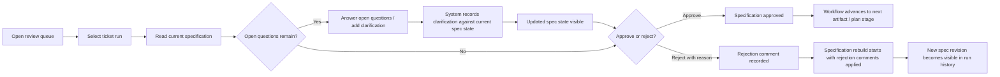
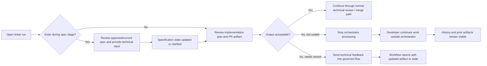
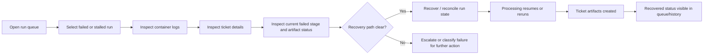
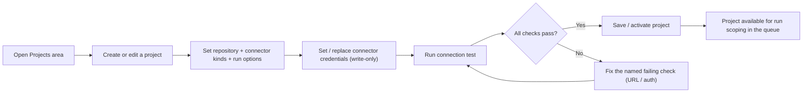

# UX Design Specification ai-hackaton-1

**Author:** Alex
**Date:** 2026-04-23

---

<!-- UX design content will be appended sequentially through collaborative workflow steps -->

## Executive Summary

### Project Vision

ai-hackaton-1 is a governed, local-first workflow for low-risk software delivery using coding agents. Its value is not generic orchestration or autonomous execution. It gives teams a controlled way to inspect, review, recover, and hand off AI-assisted work without losing context.

The MVP focuses on one feature-delivery workflow with ticket intake, specification review, implementation output, developer review or takeover, visible run history, recovery/reconciliation, and merge-ready handoff. The React UI is a minimal review surface inside this governed flow.

### Target Users

The primary MVP users are:
- **Product reviewer / PM** who needs to review generated scope and outcome, understand changes, and approve or reject with confidence.
- **Developer reviewer** who needs technical lineage, implementation output, diagnostics, and safe takeover options.
- **Workflow owner / operator** who needs to diagnose failures, inspect run history, and determine the next safe recovery action.

These users are technical or adjacent to technical workflows. They care more about operational clarity, trust, and safe decisions than ornamental UI.

### Key Design Challenges

- Making workflow state, artifact version, and allowed next actions immediately understandable.
- Balancing product clarity, developer detail, and operational recovery needs in one primary run-centered experience.
- Preventing stale approvals, hidden conflicts, and misleading trust signals in a workflow that can change between review and action.
- Making failed, conflicted, and no-action states legible without forcing users into raw logs first.
- Separating trusted system metadata from untrusted generated output.

### Design Opportunities

- Use the governed run record as the center of the experience so every persona sees one source of workflow truth with different emphasis.
- Turn visibility and recovery into a UX advantage by making change summaries, failure reasons, and next safe actions explicit.
- Differentiate from ad hoc agent tooling by making review and handoff feel structured, inspectable, and recoverable rather than opaque.
- Create a decision-oriented review surface that answers what happened, what is current, what changed, and what is safe to do next.

### Cross-Functional UX Insight

This product's UX must optimize for governed decision-making rather than generic workflow browsing. The primary user experience value is not visual polish or broad operational coverage; it is fast, trustworthy understanding at the moment a user must approve, reject, retry, take over, or reconcile work.

From a product perspective, the review experience must make the ticket stage, artifact under decision, latest changes, and decision consequences explicit. From an engineering perspective, the UI must remain backend-truthful: allowed actions, version conflicts, stale data, and recovery states come from workflow state rather than frontend inference. From a UX perspective, the interface should reduce state uncertainty, artifact uncertainty, and action uncertainty so users can understand what is current and what is safe to do next.

This means the UX should be treated as a controlled inspection and decision surface, not a generic dashboard.

### Persona-Centered UX Implications

The three MVP personas all rely on the same governed run record, but they need different emphasis from the interface.

- **Product reviewer:** needs clear visibility into scope, latest changes, and whether the artifact under review still matches intent. The UX should emphasize change summary, approval context, and decision clarity over implementation detail.
- **Developer reviewer:** needs technical lineage, implementation output, diagnostics, and safe takeover paths. The UX should emphasize artifact lineage, approved context, and technical next actions.
- **Workflow owner:** needs failure diagnosis, last safe state, conflict visibility, and recovery guidance. The UX should emphasize failure reason, run state, system disagreement, and next safe action.

The UX should therefore provide one primary run-centered experience with different information emphasis by context, rather than separate disconnected product, developer, and operations views.

### First-Principles UX Foundation

The UX should be designed around the minimum truths users need in order to trust and use a governed agent workflow. The interface must answer four questions quickly and consistently: what happened, what is current, what changed, and what is the next safe action.

The product's UX differentiation is not generic orchestration visibility. It is the ability to inspect, govern, recover, and hand off AI-assisted work without losing context. This means the primary UX priorities are run-state clarity, artifact/version clarity, action safety, and recovery clarity.

The UX should avoid generic dashboard sprawl, hidden failure/conflict states, misleading trust signals, and unnecessary dependence on raw logs for normal decision-making.

### UX Risk and Failure Considerations

This product's UX must treat stale state, failed runs, conflicts, and recovery as first-class experience conditions. Users need to understand not only the happy path of review and approval, but also when an artifact is stale, when context changed, when no action is currently safe, when generated output is untrusted, and how recovery should proceed.

This creates a key UX requirement: the interface should make failure and conflict states legible without forcing users into raw logs first. Change visibility, last safe state, current blocking reason, and next safe action are core UX needs, not secondary operational details.

### Product Scope and Trust Boundary

The MVP is focused on low-risk software delivery work that can tolerate structured human review, explicit approval gates, and manual recovery without blocking safety-critical or highly regulated workflows. The product is not designed to automate high-risk decisions; it is designed to govern agent-assisted delivery work that still benefits from human judgment.

Local-first operation is part of the user value, not just a deployment choice. It supports faster setup, reduced coordination overhead, greater privacy for local work artifacts, and simpler recovery when runs fail or need takeover.

The core governed decisions in the MVP are approve, reject, retry, take over, and reconcile or escalate. The UX should make clear who is acting in each decision context, what is being decided, and whether a role is enforced by the system or only recorded for audit.

### UX Truth Model

The UI must present backend-observed workflow truth rather than inferred certainty. Run state, allowed actions, conflicts, stale conditions, and recovery status come from backend state and events, not from frontend guesswork or generated output.

This means:
- the UI should never invent status, progress, or completion;
- stale data should be visibly labeled;
- next safe action should mean an action the backend can validate for the current run state;
- generated agent output should be treated as advisory or untrusted until it is explicitly accepted, persisted, or linked to a system decision.

The product should therefore be framed as a primary run-centered decision surface that separates system facts, persisted decisions, and generated suggestions so users can act without false confidence.

## Core User Experience

### Defining Experience

The core MVP experience is a governed review-and-clarification workflow. Users most frequently review specifications and execution logs, then respond to open questions or gaps before the workflow proceeds. The most critical interaction is not generic approval alone, but providing answers to open questions in a way that is clearly captured, persisted, and reflected in the evolving specification and implementation context.

If the MVP gets one interaction right, it should be this: a reviewer can read the current specification, understand unresolved questions, provide answers, and trust that those answers become part of the workflow state rather than being ignored or lost. This interaction defines the product's credibility more than any dashboard or reporting surface.

### Platform Strategy

The MVP experience spans a bundled React application and a Spring CLI. The React application is the primary visual review surface for specification inspection, execution visibility, and question resolution. The Spring CLI remains part of the operator workflow for local-first control and diagnostics.

Primary usage is mouse-and-keyboard desktop interaction. Mobile and touch-first optimization are not MVP priorities. Offline-specific behavior is not required beyond the product's local-first architecture, where the system runs locally with its dependent services.

### Effortless Interactions

The following interactions should feel as frictionless as possible:

- reviewing the current specification and immediately seeing unresolved questions, blocked decisions, and missing clarifications;
- providing answers to open questions without hunting through logs or unrelated workflow detail;
- confirming that submitted answers have been recorded, version-bound, and applied to the active workflow context;
- understanding whether a specification is truly ready for approval or still blocked by unresolved uncertainty;
- configuring local security and integration settings through explicit, trustworthy setup flows that do not feel provisional or hidden.

The product should minimize any ambiguity about whether user input was accepted, whether the workflow incorporated it, and whether additional clarification is still required.

### Critical Success Moments

There are three decisive moments in the MVP experience:

- **Product review success:** a PM or product reviewer sees that all open questions have been answered, all blocking clarifications have been incorporated, and the specification is now safe to approve.
- **Developer takeover success:** a developer sees an approved specification and a created implementation plan, and can take over the run without reconstructing missing context.
- **Trust confirmation:** after a reviewer answers an open question or gives feedback on the implementation plan, the system visibly reflects that input in the active workflow state rather than continuing as if nothing changed.

The fastest way to destroy trust is for users to provide answers or feedback and then watch the workflow continue as if nothing was provided. Ignored clarification is a make-or-break failure for this product.

### Experience Principles

- **Clarification must change the system:** when users answer open questions or provide plan feedback, the workflow must visibly incorporate that input.
- **Readiness must be legible:** users should be able to tell when a specification is complete enough to approve and when gaps still remain.
- **Context must survive handoff:** approved specification, implementation plan, and execution evidence must make takeover possible without reconstruction work.
- **Local control must feel concrete:** the local-first model, including security and configuration, should feel explicit, trustworthy, and manageable.

### Core Experience Emphasis

The defining MVP interaction is not passive review. It is resolving uncertainty in the specification and confirming that the workflow incorporates that clarification.

For product reviewers, open questions must be explicit, answerable, and visibly tied to specification completeness. For developers, those answers must be traceable into the current specification and implementation plan. For workflow owners, the system must distinguish between unanswered questions, answered-but-not-applied input, stale clarification, and correctly incorporated changes.

This means the core experience should emphasize question resolution, answer traceability, and visible incorporation of reviewer input rather than generic workflow browsing.

### Clarification Lifecycle Visibility

The MVP core experience must make clarification handling visible as a lifecycle, not as a hidden side effect. When a user answers an open question or provides feedback on an implementation plan, the interface should make clear whether that input is pending review, applied to the active specification or plan, superseded by later changes, stale against a newer version, or ignored due to validation or workflow-state constraints.

Workflow trust depends on users being able to see the effect of their input. The system should not only capture answers and feedback, but also show whether the active workflow context changed because of them. If clarification was not applied, the interface should communicate why the workflow cannot proceed as if the issue were resolved.

### First-Principles Core Interaction

The minimum credible interaction in the MVP is clarification with confirmed effect. A user must be able to see an unresolved question, provide an answer, and understand whether that answer changed the active specification or implementation context.

This interaction requires five things to be obvious in the UX:
- what question is still unresolved;
- what answer was provided;
- which specification or plan version that answer belongs to;
- whether the answer changed the active workflow context;
- whether approval or implementation is still blocked by remaining uncertainty.

If the product cannot make that chain visible, the workflow may be auditable, but it will not feel trustworthy.

### Uncertainty-Reduction Experience

The MVP core experience should be framed as uncertainty reduction with visible workflow effect. Users are not primarily coming to inspect a static document or timeline; they are coming to reduce ambiguity in the current run and confirm that the system has incorporated that reduction correctly.

This means the UI should prioritize unresolved questions, answer submission, incorporation status, and blocked-versus-ready workflow state over passive reading or generic dashboard summary. The best version of the experience feels progressive: uncertainty is surfaced, clarification is given, the system acknowledges what changed, and the workflow either advances or clearly explains what still prevents progress.

### Governed Clarification Loop

The core MVP experience should be framed as a governed clarification-and-approval loop. Users are not primarily reading artifacts for their own sake; they are deciding whether the workflow is safe to move forward and what changed because they intervened.

This makes the primary user job more precise: resolve ambiguity, confirm the effect of that clarification on the active workflow state, and only then approve or hand off with confidence.

### Observable Clarification Contract

Clarification handling should be defined as an observable contract, not only as a user expectation. Every answer to an open question or piece of feedback on the implementation plan should either:

- change the active workflow state in a visible way; or
- show a visible reason why no workflow change occurred.

A clarification that is accepted by the UI but not reflected in the next visible workflow state is a core UX failure.

### Clarification State Model

The UX should make the clarification lifecycle explicit. At minimum, users should be able to distinguish:

- open clarification
- answered clarification
- accepted clarification
- rejected clarification
- superseded clarification
- incorporated into active workflow context

The interface should also distinguish between blocking clarifications, non-blocking notes, plan feedback, and implementation constraints so users understand what kind of input they are giving and what effect it should have.

### Traceability and Provenance

The core experience should make clarification traceable end to end. Users should be able to see:

- what question or issue was raised;
- who answered or responded;
- which specification or plan version the response belongs to;
- what changed because of that response;
- what remains blocking;
- whether workflow progression is still prevented by unresolved or accepted-but-visible risk.

This traceability should carry into approval and developer takeover so continuation does not require reconstructing intent from scattered logs.

### Approval and Takeover Continuity

Approval should not depend only on "all questions answered." It should depend on blocking clarifications being incorporated, remaining risk being explicitly visible, and the active specification and plan reflecting the current decision state.

Developer takeover should be framed as continuity rather than simple handoff. The approved specification and implementation plan should carry forward clarification decisions, unresolved risks, accepted constraints, and superseded answers so a developer can continue without rebuilding context manually.

## Desired Emotional Response

### Primary Emotional Goals

The primary emotional goal of the MVP is calm control under uncertainty. Users should feel clear-headed rather than rushed, and in control rather than dependent on opaque automation.

The product should make users feel:
- calm
- clear-headed
- in control
- reassured
- efficient

These emotional goals fit a governed workflow product where trust comes from visibility, traceability, and safe intervention rather than from speed alone or a sense of autonomous magic.

### Emotional Journey Mapping

The emotional journey should evolve across the workflow:

- **First opening a run:** users should feel skeptical in the right way. The interface should support scrutiny rather than asking for blind trust.
- **While answering open questions or reviewing plan feedback:** users should feel in control, with a clear sense of what they are changing and what effect that input will have.
- **After approval or takeover:** users should feel efficient, because the workflow has reduced ambiguity and preserved the necessary context to move forward.
- **When something goes wrong:** users should feel curiosity and safe recoverability instead of panic or distrust. The product should help them understand what happened and how to safely return to a prior step if needed.
- **When returning later:** users should feel the same calm control they felt earlier, with continuity rather than disorientation.

### Micro-Emotions

The most important micro-emotions for this product are:

- **Confidence over confusion:** users should understand the current run state and the effect of their actions.
- **Earned trust over premature confidence:** the product should move users from healthy skepticism to justified reassurance through visible state changes and traceability.
- **Reassurance over anxiety:** after answering questions, approving work, or taking over a run, users should feel that the workflow state is dependable.
- **Accomplishment over frustration:** resolving uncertainty should feel conclusive rather than circular.
- **Curious control over panic:** when something breaks, users should feel able to investigate and safely step back rather than feeling trapped or blamed.

This product should preserve healthy skepticism at the beginning of an interaction and convert it into confidence only when the system provides enough evidence.

### Design Implications

If the desired emotional state is calm, clear-headed control, the UX should support it through explicit design choices:

- **Calm and clear-headed** -> restrained visual hierarchy, unambiguous state labels, minimal decorative noise, and explicit explanation of what changed.
- **In control** -> visible allowed actions, clear input-effect feedback, recoverable workflows, and strong version/state traceability.
- **Reassured** -> confirmation that clarification was incorporated, approval is grounded in visible criteria, and takeover preserves context.
- **Efficient** -> low-friction access to unresolved questions, current blockers, and next safe actions without hunting through the interface.
- **Curious instead of panicked when things break** -> failure states that explain cause, last safe point, and recovery path rather than only surfacing raw errors.

The interface should avoid emotional patterns that create false confidence, hidden uncertainty, or busy operational stress.

### Emotional Design Principles

- **Earn trust, do not assume it:** the product should support healthy skepticism first and reassurance second.
- **Calm comes from clarity:** users feel calm when state, change, and consequences are legible.
- **Control must be visible:** users should always understand what actions are available and what those actions will affect.
- **Recovery should reduce fear:** when the workflow breaks, the product should replace panic with safe curiosity and clear recovery options.
- **Efficiency should feel disciplined, not rushed:** the experience should reduce friction without hiding uncertainty or skipping governance.

### First-Principles Emotional Contract

The emotional goal of the MVP is not delight, surprise, or automatic confidence. It is disciplined calm under uncertainty.

Users should feel calm enough to think clearly, skeptical enough to question unverified output, in control enough to intervene safely, and reassured only after the system has provided visible evidence that their input changed the workflow state appropriately.

This means trust should be treated as an earned emotional outcome rather than a default starting condition. The product should not try to make users feel certain too early. It should help them move from healthy skepticism to justified reassurance through clarity, traceability, and safe recovery.

### Emotions to Avoid

The product should explicitly prevent these emotional failure states:

- **suspicion** caused by input that appears accepted but has no visible effect;
- **distrust** caused by hidden ambiguity or workflow progression that is not justified by visible state;
- **anxiety** caused by failures that feel unrecoverable or poorly explained;
- **manipulation** caused by polished UI signals that imply certainty the system has not earned;
- **cognitive fatigue** caused by operational noise without clear prioritization;
- **false confidence** caused by calm presentation that hides unresolved risk.

These negative emotions are as important to design against as the positive states the product wants to create.

### Persona-Specific Emotional Targets

The emotional goals are shared across the MVP, but each primary persona experiences them differently:

- **Product reviewer:** should feel justified reassurance. Calm comes from visible completeness, visible blockers, and explicit remaining risk.
- **Developer:** should feel controlled continuity. Confidence comes from preserved decisions, traceable clarification history, and clear takeover context.
- **Workflow owner:** should feel curious control. Recovery states should support diagnosis and safe return rather than blame, panic, or noise.

This means the product should produce one coherent emotional tone overall, but tune its emphasis so each persona feels appropriately supported in the decisions they are making.

### Evidence-Backed Emotional Tone

The emotional tone of the product should be composed, evidence-backed, and operationally calm. Users should feel supported in making careful decisions, not rushed toward premature certainty and not overwhelmed by noisy operational detail.

This means calm should come from visible proof, not from soft presentation alone. Reassurance should follow incorporation, traceability, and recoverability. Efficiency should feel disciplined rather than hurried. The emotional character of the interface should help users think clearly under uncertainty and remain effective when ambiguity or failure is present.

### Emotional Trust Journey

The desired emotional response should be described as a staged trust journey rather than a flat set of positive feelings.

The journey begins with rational skepticism. Users should feel cautious, attentive, and oriented when they first enter a run. The interface should respect that skepticism rather than trying to override it with premature reassurance.

As users review the run, answer questions, inspect changes, and observe visible workflow effects, that skepticism should shift into informed confidence. Reassurance should come only after the product provides evidence through traceability, visible change, approval boundaries, and recoverability.

The desired end state is not blind trust in the agent. It is confidence in the governed process: users feel in control, able to verify the decision path, able to continue without losing context, and able to recover without guessing.

### Emotional Proof Points

The product should earn its emotional outcomes through observable proof. Users should feel calm, confident, and in control because they can quickly answer:

- what changed;
- who or what changed it;
- whether it was incorporated into the active workflow;
- whether it can be reversed or revisited;
- what risk still remains visible.

This means emotional design should favor transparency over persuasion. The interface should feel steady and legible, not soothing in a way that hides uncertainty.

### Refined Emotional Guardrails

The product should explicitly avoid these emotional anti-patterns:

- **premature confidence** before evidence is shown;
- **surprise** caused by unexpected workflow progression or state change;
- **persuasive overreach** where the interface appears to push trust rather than earn it;
- **unnecessary cognitive load** caused by operational noise or weak prioritization.

Efficiency should be treated as low-friction progress, not speed for its own sake. The emotional win is not that the workflow feels fast; it is that users can move forward without wasting attention and without losing inspectability.

## UX Pattern Analysis & Inspiration

### Inspiring Products Analysis

The strongest inspiration sources for this product are IntelliJ IDEA, GitHub, CLI-based AI tools such as Claude or Codex, and Jira.

- **IntelliJ IDEA** is relevant because it supports clear inspection of dense technical content. It helps users read code and specifications without losing orientation, even when the information is detailed.
- **GitHub** is relevant because it makes feedback easy to provide inside a review workflow. It gives users a practical way to inspect work, comment on specific issues, and move a review process forward.
- **CLI-based AI tools such as Claude and Codex** are relevant because they make interaction direct. Users can answer in plain text, choose from explicit options, or add their own comment without navigating heavy UI ceremony.
- **Jira** is relevant because it makes work state visible and operationally explicit. At the same time, it demonstrates an important warning: workflow visibility should not turn into query-heavy or process-heavy complexity.

Across these inspirations, the target tone for this product is closest to a mix of GitHub review discipline, IntelliJ IDEA clarity, and CLI directness.

### Transferable UX Patterns

The most transferable patterns for this product are:

**Navigation Patterns**
- a run-centered review flow rather than broad dashboard navigation;
- visible workflow state and current blockers without requiring advanced filtering or query building;
- desktop-oriented layout that supports dense technical reading without feeling cluttered.

**Interaction Patterns**
- easy feedback submission directly in context, inspired by GitHub reviews;
- direct text response for answering open questions or providing implementation feedback;
- structured interaction that allows users to either choose from explicit options or provide their own comment;
- visible work-state progression inspired by Jira, but simplified for a governed review workflow.

**Visual Patterns**
- clear reading surfaces for specifications, plans, and technical artifacts, inspired by IntelliJ IDEA;
- restrained, evidence-focused presentation rather than decorative dashboards;
- strong emphasis on inspectability, state clarity, and feedback traceability.

### Anti-Patterns to Avoid

The UX should explicitly avoid these anti-patterns:

- workflow complexity that resembles Jira query or process overhead;
- navigation structures that make users hunt for the current run state or open questions;
- feedback flows that feel indirect, buried, or disconnected from the reviewed artifact;
- visually noisy dashboards that reduce reading clarity for specs, plans, or execution evidence;
- interaction models that force users into rigid forms when a direct text response or simple structured choice would work better.

### Design Inspiration Strategy

**What to Adopt**
- GitHub-style ease of review feedback because the product depends on users being able to comment, answer, and clarify without friction.
- IntelliJ IDEA-style reading clarity because users need to inspect dense specifications, plans, and technical output with confidence.
- CLI-style directness because open-question handling should support fast text responses and lightweight structured choices.
- Simplified Jira-style state visibility because users need to see work progression and blockers at a glance.

**What to Adapt**
- Review interactions should be adapted from GitHub to support governed clarification and workflow-state changes, not only comment threads.
- Dense reading patterns from IntelliJ IDEA should be adapted to specification and artifact review rather than full developer IDE complexity.
- Direct response patterns from CLI tools should be adapted into a React review surface that still feels lightweight and explicit.
- Work-state visibility from Jira should be adapted into a much simpler, run-focused model with minimal workflow bureaucracy.

**What to Avoid**
- Jira-like complexity in filters, workflow configuration, or query mental load.
- IDE-like visual density that overwhelms non-developer reviewers.
- AI-chat patterns that feel too informal or detached from governed workflow state.
- Review patterns that encourage discussion without clearly showing whether the workflow changed as a result.

### Comparative Inspiration Matrix

The inspiration sources contribute different strengths and different risks:

| Source | Strength to Borrow | Risk to Avoid | Intended Use in This Product |
|---|---|---|---|
| GitHub | in-context review and easy feedback | comment activity without visible workflow effect | artifact review, approvals, clarification comments |
| IntelliJ IDEA | clear inspection of dense technical material | overwhelming IDE-style density | specification, plan, and code/artifact reading surfaces |
| CLI / Claude / Codex | direct text response and option-plus-comment interaction | informal interaction detached from governed state | answering open questions, lightweight feedback, explicit action prompts |
| Jira | visible work state and ownership | workflow/query complexity and process drag | simplified run state, blockers, ownership, next safe action |

This matrix suggests a blended UX strategy: review ergonomics from GitHub, reading clarity from IntelliJ IDEA, direct response patterns from CLI tools, and simplified state visibility from Jira.

### Inspiration Risk Controls

Borrowed patterns should be constrained so they support the product's governed workflow rather than import unrelated tool complexity.

- GitHub-inspired feedback should always show whether comments or answers changed workflow state.
- IntelliJ IDEA-inspired density should be limited to reading surfaces and should not overwhelm non-developer reviewers.
- CLI-inspired direct response should stay tied to explicit workflow context, provenance, and allowed actions.
- Jira-inspired state visibility should remain simple and run-focused, without exposing users to query-builder or workflow-administration complexity.
- The overall interface should feel like one coherent review-and-clarification product, not a collage of developer tools.

### Resulting UX Character

The purpose of these inspiration sources is not to imitate familiar tools. It is to define the character of the resulting product.

The intended character is a focused review workstation for governed agent delivery:
- as easy to respond within as GitHub review;
- as readable as a good technical editor;
- as direct as a CLI interaction when answering questions or choosing actions;
- as state-aware as a simplified work-tracking tool.

It should not feel like a generic dashboard, a chat-first AI tool, a full IDE, or a workflow bureaucracy system. The inspiration strategy should be judged by whether it strengthens readable inspection, direct clarification, visible workflow effect, and calm operational control.

### First-Principles Pattern Extraction

The value of the inspiration sources is not their brand or visual style. It is the capabilities they demonstrate.

From these tools, the product should retain only the essential UX capabilities:
- clear reading of dense technical material;
- low-friction feedback and question answering;
- immediate visibility of current state, blockers, and ownership;
- explicit evidence that user input changed the active workflow context.

This keeps the design strategy focused on the product's real UX needs rather than on imitation of familiar tools.

### Governing Design Principle

The purpose of these inspirations is to support one governing UX principle:

**The experience should let reviewers understand, comment on, and approve agent-generated work in place, with minimal ceremony and maximal traceability.**

This product should optimize for fast, trustworthy review of agent-assisted work with low cognitive overhead and strong decision confidence.

### Inspiration By Job To Be Done

The inspiration strategy should be understood by the behaviors the product needs to support, not only by the source products themselves.

**Dense reading and inspection**
- inspired by technical editors such as IntelliJ IDEA
- used to support clear reading of specifications, plans, diffs, and technical artifacts
- should favor readable density, orientation, and progressive disclosure

**Inline review and decision capture**
- inspired by GitHub review and direct CLI-style interaction
- used to support low-friction, inline, attributable feedback, explicit option selection, and lightweight comment capture
- should favor contextual review, threaded decisions, and fast clarification without excess ceremony

**State legibility and workflow progress**
- informed partly by Jira, mostly as a cautionary reference
- used to support just enough workflow visibility for trust, blockers, ownership, and next-step clarity
- should avoid project-tracker bureaucracy, queue obsession, and query-builder complexity

### Additional Transferable Patterns

Beyond the named inspiration sources, the product should explicitly carry these patterns forward:

- **decision provenance:** every recommendation, objection, clarification, and approval should be attributable and easy to revisit;
- **diff-first review:** the change set should be a primary object of attention, not only surrounding discussion;
- **controlled comparison:** before/after and side-by-side review patterns should help users inspect what actually changed;
- **review continuity:** users should be able to leave and return without losing the thread of what changed, what was decided, and what remains open;
- **exception visibility:** partial approvals, blocked states, conflicting outputs, and retry loops should be visible without turning the UI into a form-heavy admin system.

### Refined Product Character

The resulting UX should be framed positively as a review-centric control surface for agent-assisted delivery.

It should feel:
- readable and technically clear;
- direct to respond within;
- traceable and attributable;
- state-aware without becoming bureaucratic.

It should not be defined primarily as “not a dashboard” or “not a chat app.” Those are useful guardrails, but the stronger definition is that the product is a governed decision surface built for reviewing and advancing low-risk agent work with clarity and control.

## Design System Foundation

### 1.1 Design System Choice

The design system foundation for this product should be a themeable system built on `shadcn/ui + Tailwind`.

This approach gives the project the right balance between speed and product-specific control. It preserves the practical advantages of proven UI primitives while allowing the interface to feel purpose-built for governed review, clarification, and decision-making rather than obviously inheriting the look of a generic component library.

### Rationale for Selection

This design system choice fits the product because:

- the project values balance over pure speed or pure uniqueness;
- the desired product tone is a mix of internal review tool and developer tool, not a marketing-heavy SaaS interface;
- the interface needs medium-density reading and review surfaces for specifications, workflow state, clarifications, diffs, and logs;
- the product needs flexibility for domain-specific UI patterns such as clarification state, approval readiness, blockers, stale state, and recovery actions;
- the existing architecture already aligns with `shadcn/ui + Tailwind`, making this the most coherent UX and implementation choice.

A fully custom design system would add unnecessary cost for the MVP. A strongly opinionated established system would increase the risk of generic or mismatched visual tone. A themeable foundation gives enough structure without sacrificing control.

### Implementation Approach

The implementation should use `shadcn/ui` primitives as the base layer and Tailwind as the styling and layout system.

The design system should emphasize:
- medium-density layouts that support reading and review without becoming cramped;
- strong hierarchy for workflow state, blockers, approvals, and clarification lifecycle;
- consistent primitives for buttons, tabs, dialogs, badges, tables, forms, alerts, and scrollable review panels;
- desktop-first ergonomics for mouse and keyboard users;
- restrained styling that supports calm, evidence-backed, inspectable interaction.

The product should not feel like a generic admin dashboard or a visual demo of the component library. It should feel like a governed review surface built from disciplined primitives.

### Customization Strategy

Customization should be deliberate and constrained.

**What to customize**
- color usage for workflow state, blockers, approval, stale state, recovery, and informational status;
- typography hierarchy for reading specifications, plans, and technical artifacts;
- spacing and panel structure for medium-density review surfaces;
- domain-specific components for clarification lifecycle, approval readiness, diff/context review, and workflow state transitions;
- feedback and status treatments that emphasize evidence, traceability, and controlled progress.

**What to avoid**
- heavy visual branding or ornamental styling that reduces clarity;
- flashy gradients, decorative dashboard tropes, or consumer SaaS aesthetics;
- default component-library appearance without product-specific refinement;
- uncontrolled one-off custom components that break consistency.

The system should feel neutral, custom-toned, and operationally calm: recognizably structured, but clearly tailored to this product's governed review workflow.

### Design-System Character

The design system should be neutral, custom-toned, and review-first. It should not look like a generic SaaS dashboard, a consumer product, or a raw component-library demo.

The intended visual character is:
- operationally calm rather than visually loud;
- medium-density rather than sparse or cramped;
- technically readable rather than decorative;
- product-specific in state treatment and review flows, while remaining standard in basic controls.

### Foundation Boundary

`shadcn/ui` should provide the primitive component layer. Tailwind should provide layout, spacing, and theming control. Product differentiation should come primarily from composition, hierarchy, density, state semantics, and domain-specific components rather than from heavily restyled primitives.

This means the system should keep standard controls recognizable while making workflow state, clarification lifecycle, approval readiness, blockers, and recovery conditions visually distinct in a product-specific way.

### Strategic Value of the Foundation

The design system foundation is appropriate not only because it is fast to implement, but because it preserves design and engineering effort for the parts of the interface that actually differentiate the product.

Standard primitives should cover general controls such as buttons, tabs, dialogs, tables, and forms. Product-specific effort should be concentrated on governed review surfaces: specification reading, clarification lifecycle, approval readiness, blockers, diff/context comparison, workflow state, and recovery paths.

This is the strategic value of the chosen foundation: it avoids spending MVP effort on reinventing basic controls while leaving enough flexibility to make the domain-specific parts of the product feel intentional, coherent, and trustworthy.

## 2. Core User Experience

### 2.1 Defining Experience

The defining experience of this product is advancing a ticket through a governed resolution flow with clear visibility, explicit review points, and traceable artifact generation.

Users should be able to take a ticket from ambiguity toward implementation by reviewing generated output, answering open questions, making go/no-go judgments, and seeing the workflow produce the next concrete artifact such as a specification, implementation plan, or pull request.

The product becomes valuable when ticket resolution feels organized, visible, and effective rather than scattered across disconnected tools and informal handoffs.

### 2.2 User Mental Model

Users currently think about this work as a sequence of manual stages:

1. read the ticket;
2. create or review a specification;
3. answer open questions or clarify gaps;
4. execute or supervise implementation;
5. review coding-agent output;
6. create and approve a pull request;
7. merge once the result is accepted.

Their mental model is not “use a workflow product.” It is “move this ticket safely to done without losing the thread.”

What frustrates them in the current approach is lack of visibility and continuity. Tickets can get lost in the middle of the process, and when something goes wrong it is hard to tell what happened, what was missed, or what decision caused the problem.

The product should therefore match the user's existing mental model of staged resolution, but make each stage visible, attributable, and easier to inspect.

### 2.3 Success Criteria

The core experience succeeds when users feel that the system keeps the ticket moving forward without losing clarity or control.

Success indicators include:

- users can see where the ticket currently is in the resolution flow;
- users can review generated output and answer open questions without ambiguity about what happens next;
- each important decision produces or advances a concrete artifact;
- the system makes it easy to tell what was done, what remains open, and where something went wrong if progress stalls;
- after successful completion of a core interaction, the next expected artifact exists or is visibly advanced, such as a specification, implementation plan, or pull request;
- the implemented ticket works as expected and the workflow makes that outcome feel understandable rather than accidental.

### 2.4 Novel UX Patterns

This core experience should combine familiar patterns rather than invent a completely new interaction model.

It combines:
- **reviewing a change** through artifact inspection and comparison;
- **answering a guided set of questions** through clarification prompts and open-question handling;
- **making a go / no-go decision** through approval, rejection, retry, or takeover decisions.

These are established patterns, but the product's unique twist is combining them into one governed ticket-resolution flow with visible artifact progression and workflow traceability.

This means the UX should feel familiar enough to understand quickly, while still providing a more coherent and trackable experience than the current fragmented toolchain.

### 2.5 Experience Mechanics

**1. Initiation**
- The user opens a ticket or run and immediately sees current state, existing artifacts, open questions, blockers, and next expected decision.
- The system invites the user to continue the resolution flow from the current stage rather than starting from scratch.

**2. Interaction**
- The user reviews the current artifact, such as a specification, implementation plan, or pull request.
- The user answers open questions, provides feedback, or makes an approval decision.
- The system records that interaction against the current workflow state and artifact context.

**3. Feedback**
- The user can see whether their response changed the workflow, resolved a blocker, or generated or advanced the next artifact.
- If the system cannot proceed, it should show why clearly rather than leaving the ticket in an ambiguous middle state.
- The user should always be able to tell what was just done and what remains to be done.

**4. Completion**
- The interaction is complete when the workflow has visibly advanced and the next concrete artifact or decision state is present.
- Successful outcomes include a generated or updated specification, an implementation plan, a pull request, or a clearly advanced approval state.
- The user should leave the interaction with a stronger sense of progress, visibility, and control than they had when they entered it.

### First-Principles Defining Interaction

The core value of the product is not generic ticket organization. It is making the decision-to-artifact loop visible and governable.

The minimum defining interaction is:
- a user reviews the current state of a ticket;
- the user clarifies, approves, rejects, retries, or otherwise decides what should happen next;
- the system visibly produces or advances the next artifact or workflow state as a result.

This decision-to-artifact loop is the product's true center of gravity. If that loop is clear, traceable, and dependable, the overall workflow will feel effective. If that loop is weak or ambiguous, the product will feel like another status-tracking layer rather than a governed delivery system.

### Defining Experience Failure Conditions

The defining experience breaks if the system shows workflow state without showing workflow causality.

Users must not only see where a ticket is in the flow, but also why it moved, what decision caused the movement, what artifact resulted, and what remains unresolved. If a user makes a decision and the next artifact or workflow change is not visible and attributable, the product loses its defining value.

This means status visibility alone is insufficient. The product must make progress legible as a chain of decisions, artifacts, and resulting state transitions.

### Persona Reading of the Defining Experience

The defining experience should remain one coherent interaction loop across personas, but each role reads its value differently.

- **Product reviewer:** experiences the loop as clarification leading to the next concrete artifact.
- **Developer:** experiences the loop as preserved decision continuity from ticket through specification, plan, and implementation.
- **Workflow owner:** experiences the loop as visible cause, visible state, and visible next safe action.

This means the product should not fragment into separate product, developer, and operator experiences. It should present one decision-to-artifact loop with different emphasis depending on the user's role and purpose in that moment.

### Inspectable Movement as the Core Experience

The defining experience should be framed as inspectable movement through a governed delivery loop.

What makes the product special is not that users can read artifacts or click approvals in isolation. It is that each meaningful interaction causes visible, reviewable movement: a question is answered, a decision is made, an artifact is produced or advanced, and the workflow state changes in a way the user can inspect.

This makes the product feel active and governed rather than static and administrative. The user should leave each successful interaction with evidence that the ticket moved forward for a clear reason.

### Core Experience Trust Contract

The defining experience should be stated as a user-visible contract:

A ticket should move only when the user can see why it moved, what decision caused it, and what evidence or artifact was produced as a result.

This means every meaningful transition in the flow should be explainable in-line. Users should be able to inspect:
- the decision that was made, such as approve, reject, revise, escalate, or close;
- who or what made that decision;
- when it happened;
- what artifact, diff, note, test result, or approval record was produced;
- which state the ticket moved from and to;
- what remains unresolved after the transition.

### Governed State Progression

The core experience is not generic ticket movement. It is governed state progression with evidence-linked transitions.

The system should make visible that movement happens through enforced checkpoints, recorded rationale, and usable outputs. Governance should feel controlled but not bureaucratic: the user should not fight the workflow, but the workflow should never advance without attributable cause.

### Trust Failure Conditions

The product should explicitly treat these as defining-experience failures:

- state advanced without visible evidence;
- artifact exists without a linked state transition;
- decision exists without actor, context, or rationale;
- stale or hidden status obscures what actually happened;
- silent automation moves work forward without reviewable cause;
- resolution is implied before verification or review is complete.

If causality is missing, the ticket should feel incomplete rather than done.

### Recovery and Reversibility

The defining experience should also include visible recovery. Users should be able to understand how a bad decision, rejected step, or failed artifact is corrected, whether prior state remains visible, and how superseded artifacts are preserved in the record.

Trust comes not only from seeing successful movement, but from knowing that incorrect movement can be inspected, explained, and safely corrected.

## Visual Design Foundation

### Color System

The color system should be neutral, calm, and operationally clear, with a restrained base palette and deliberate semantic emphasis.

The visual foundation should use:
- neutral background and surface colors for long reading sessions;
- a blue-green / teal accent family as the primary interactive color;
- strong semantic colors for blockers, warnings, stale state, recovery, and approval-related status;
- high-contrast text and panel structure to support specification, plan, diff, and log review.

The palette should avoid loud gradients, consumer-product brightness, or default enterprise monotony. Its purpose is to support evidence-backed review, not visual entertainment.

Semantic color mapping should clearly distinguish:
- primary interactive actions;
- informational state;
- success / approved state;
- warning / blocker state;
- stale / recovery / attention-needed state.

Warning and blocker states should be strong and obvious so critical issues are never visually understated.

### Typography System

The typography system should support balanced reading and scanning rather than extreme density or oversized presentation.

The overall tone should feel professional and plain-utilitarian. Typography should prioritize clarity, predictable hierarchy, and fatigue-resistant reading for specifications, workflow summaries, open questions, and artifact detail.

The font strategy should assume a common modern sans-serif stack rather than a branded type system. Type hierarchy should clearly distinguish:
- page and panel titles;
- workflow state and section headings;
- artifact/body content;
- metadata, captions, and secondary labels;
- inline status and annotation text.

The type system should support both long-form reading and rapid scanning without dramatic stylistic contrast.

### Spacing & Layout Foundation

The spacing and layout foundation should be medium-density and structured.

A hybrid spacing system should be used:
- `4px` rhythm for tighter internal spacing inside controls, compact metadata groups, and dense review components;
- `8px` rhythm for panel spacing, section separation, and larger layout structure.

The application shell should follow a left-navigation layout with:
- a left navigation rail or sidebar for queue/state navigation;
- a main review pane for specifications, plans, diffs, or pull-request context;
- an optional context panel for blockers, open questions, artifact metadata, history, and supporting state.

This layout supports a review-centric workstation without becoming as heavy as an IDE-like split workspace. It allows the user to keep the main artifact central while secondary workflow context remains nearby and inspectable.

Layout principles should include:
- stable placement of workflow state and navigation;
- clear priority for the main review surface;
- optional but accessible supporting context;
- visible structure that reduces context switching during governed review work.

### Accessibility Considerations

Accessibility should be treated as a functional requirement because clarity, calmness, and control depend on legibility.

The visual system should support:
- strong text-to-background contrast;
- semantic states that are not conveyed by color alone;
- consistent heading and panel hierarchy;
- readable font sizes and line heights for long technical reading sessions;
- warning and blocker treatments that remain prominent under varied viewing conditions;
- keyboard-friendly navigation and focus visibility consistent with the desktop-first interaction model.

The design should avoid using subtle color-only distinctions for critical workflow states, and should ensure that review, blocker, and approval signals remain understandable even in dense screens.

### Visual Direction Positioning

Within the chosen design-system foundation, the product's visual direction should sit closest to neutral operational design with a slight developer-tool influence.

This means:
- calmer and more durable than polished SaaS dashboards;
- more structured and inspectable than consumer-style interfaces;
- less intimidating than a full IDE or dense engineering console;
- less bureaucratic than enterprise admin tools.

The visual goal is a review surface that remains readable and trustworthy over long sessions, while still feeling technically credible and purpose-built.

### First-Principles Visual Requirements

The visual foundation should prioritize four irreducible requirements:

- sustained readability for specifications, plans, diffs, and logs;
- immediate recognition of blockers, approvals, stale state, and recovery state;
- stable hierarchy across navigation, main review content, and supporting context;
- visual evidence of meaning rather than decorative styling.

This means color, typography, spacing, and layout should first serve legibility and semantic clarity. Product character should emerge through disciplined consistency and state treatment rather than through visual flourish.

### Visual Consistency as Trust Infrastructure

Visual consistency should be treated as part of the product's trust model.

If similar workflow states, blockers, approvals, warnings, or artifact panels look inconsistent across the interface, users will lose confidence in what the system is telling them. Consistency is therefore not only an aesthetic concern; it is part of how the product communicates reliable meaning.

The visual foundation should enforce consistent semantic treatment for:
- state and status indicators;
- blocker and warning surfaces;
- approval and decision controls;
- artifact reading panels;
- supporting metadata and context panels.

This consistency helps the interface feel dependable over time as the workflow expands.

### Visual Decision Rules

The visual foundation should be governed by an explicit priority order:

**semantic clarity > scanability > visual consistency > stylistic nuance**

When visual decisions conflict, the interface should always favor meaning and review efficiency over aesthetic flourish.

### Non-Negotiable Visual Rules

The interface should follow these non-negotiable rules:

- use restrained, low-saturation surfaces so review content remains primary;
- use accent color deliberately and sparingly, not as ambient decoration;
- encode status and priority through stable semantic patterns, not through arbitrary variation;
- preserve strong contrast, focus visibility, and readable text hierarchy at all times;
- avoid decorative effects, playful motion, glossy SaaS styling, terminal aesthetics, and layout novelty that compete with operational clarity.

### State Semantics

The visual system should define and reuse stable treatments for at least these states:

- informational
- success / approved
- warning
- blocker
- draft / inactive
- selected / focused
- loading
- error
- permission-restricted
- empty

Blocker and warning states should remain visually dominant over informational styling, and semantic state should never rely on color alone.

### Density and Review Scanning Rules

The product should be medium-density by default, with adaptive density by task:

- compact metadata blocks and state summaries where quick scanning matters;
- expanded reading areas where specifications, plans, diffs, or logs require sustained attention;
- predictable placement of labels, metadata, and status cues to support rapid comparison and error detection.

The layout should optimize for both sequential reading and lateral comparison in the same workspace.

### Visual Anti-Goals

The visual system should explicitly avoid:
- consumer-app gloss;
- decorative ambiguity;
- playful or non-functional motion;
- soft status colors that blur risk severity;
- fragmented panel styling across navigation, main review, and context areas.

### Consistency as Reliability

Inconsistent spacing, color usage, status treatment, or component behavior should be treated as product defects because they increase cognitive load and reduce trust in governed review work.

The visual system should therefore enforce stable treatment across:
- panels and panes;
- status badges and warning surfaces;
- approval and decision controls;
- metadata and timestamps;
- loading, empty, error, and permission states.

## Design Direction Decision

### Design Directions Explored

Six design directions were explored for the MVP review surface:

- **Direction 1: Balanced Tri-Pane Review Desk** emphasized a stable review workstation with left navigation, a central artifact pane, and a supporting context panel.
- **Direction 2: Artifact-First Focus Layout** emphasized cleaner reading and lighter operational chrome, keeping the artifact dominant.
- **Direction 3: Queue-Centered Review Console** emphasized workflow triage and queue management.
- **Direction 4: Timeline-Led Evidence Lens** emphasized causality, history, and audit-oriented explanation.
- **Direction 5: Compare Desk** emphasized before/after review and explicit proof of change.
- **Direction 6: Command Hybrid Review Surface** emphasized direct prompt/response interaction and low-ceremony clarification handling.

### Chosen Direction

The preferred direction is a combination led by **Direction 1: Balanced Tri-Pane Review Desk**.

The product should use:
- **Direction 1** as the primary application shell;
- **Direction 2** as an influence on artifact-first reading clarity and lighter review emphasis;
- **Direction 5** as a dedicated comparison mode or embedded review pattern for showing what changed between revisions.

This creates a review-centric control surface where the main artifact remains primary, supporting context stays nearby, and comparison workflows can be invoked when users need stronger evidence before approving or moving forward.

### Design Rationale

This direction was chosen because it best matches the product's core UX requirements:

- it keeps the main artifact primary rather than letting queue or operational chrome dominate;
- it supports governed movement through a stable shell with visible context;
- it feels calm, evidence-backed, and review-centric rather than dashboard-heavy;
- it allows blockers and open questions to remain visible without overwhelming the main reading surface;
- it preserves enough structure for PM, developer, and workflow-owner use without turning the interface into a full IDE or admin console;
- it leaves room for compare/diff-driven trust building when users need to inspect what changed because of a decision.

The result is a hybrid direction: one stable review desk, lighter artifact reading behavior, and explicit comparison support for evidence-heavy decisions.

### Implementation Approach

Implementation should proceed with:
- a tri-pane shell as the default desktop layout;
- a main artifact review surface designed with the cleaner reading behavior of Direction 2;
- a right-side supporting context panel for blockers, open questions, lineage, and workflow metadata;
- a dedicated compare mode or embedded before/after comparison pattern based on Direction 5;
- consistent state and semantic styling carried across the shell, comparison views, and clarification flows.

This approach keeps the core experience coherent while allowing specialized review modes for higher-trust decisions.

### Direction Selection Matrix

The chosen direction is a hybrid because the product needs multiple strengths that no single mockup covered alone.

| Direction | Strength | Weakness | Role in Final Direction |
|---|---|---|---|
| Balanced Tri-Pane Review Desk | strongest default shell for governed review | risk of context clutter | primary layout foundation |
| Artifact-First Focus Layout | strongest reading and artifact emphasis | weaker persistent workflow context | influence on main pane behavior |
| Queue-Centered Review Console | strongest operational triage | weak artifact primacy | not selected as primary direction |
| Timeline-Led Evidence Lens | strongest causality explanation | too audit-heavy as default | supporting secondary view |
| Compare Desk | strongest before/after trust-building | too specialized as default shell | dedicated comparison mode |
| Command Hybrid Review Surface | strongest direct response interaction | can underweight artifact review | interaction pattern influence only |

This matrix explains why the final direction uses Direction 1 as the shell, Direction 2 as the reading model, and Direction 5 as the explicit comparison mode.

### Hybrid Coherence Rules

The chosen direction should be treated as one coherent review system, not as multiple competing modes.

- Direction 1 provides the permanent application shell.
- Direction 2 shapes the behavior of the main artifact pane so reading remains primary and operational chrome stays restrained.
- Direction 5 exists as a dedicated comparison mode or embedded comparison pattern, not as a separate product experience.
- Direction 6 contributes lightweight response mechanics only where clarification input is needed.

To preserve coherence:
- the tri-pane shell should remain structurally stable across views;
- the main artifact should remain visually primary in every state;
- blocker, question, approval, and lineage treatments should stay semantically identical across normal review and comparison modes;
- compare mode should feel like a deeper inspection state of the same workflow, not a mode switch into a different application.

### Hybrid Failure Risks

The chosen direction should explicitly guard against these failure modes:

- context panels expanding until the tri-pane shell behaves like a dashboard rather than a review surface;
- the main artifact losing visual primacy to summaries, controls, or metadata;
- compare mode diverging into a visually separate sub-product with different hierarchy or semantics;
- prompt/response interaction patterns overtaking artifact-centered review where direct reading should remain primary;
- queue or operator needs overpowering the artifact-review workflow;
- inconsistent treatment of blockers, approvals, lineage, and stale state across normal review, compare mode, and recovery states.

These risks mean the hybrid direction should enforce a clear rule: every added view or interaction must preserve artifact primacy, semantic consistency, and review continuity.

### Direction Operating Model

The chosen direction should be framed as one primary review desk with scoped exceptions, not as a three-way visual blend.

The operating model is:

- **Direction 1** is the default and permanent application shell.
- **Direction 2** governs the behavior of the center artifact pane only, ensuring that reading remains primary and operational chrome stays secondary.
- **Direction 5** is a bounded comparison mode used only when users need explicit proof of change before approving or moving forward.
- **Direction 6** contributes minimal clarification prompts only under blocking uncertainty, and should never become ambient chat-like interaction.

### Primary Interaction Loop

Within this direction, the repeated user loop should be:

1. review the current artifact;
2. inspect supporting context;
3. enter comparison only when needed;
4. resolve the blocking question or decision;
5. return to the artifact-centered desk with updated state.

This makes the chosen direction a coherent interaction model rather than a collection of preferred screens.

### Mode Boundaries and Triggers

The design should clearly distinguish between the default desk and the two exceptions:

- **Default review state:** artifact-centered tri-pane shell with supporting workflow context.
- **Compare mode:** entered only for explicit before/after validation, version conflict, reviewer disagreement, or direct request for change proof.
- **Clarification state:** entered only when the workflow cannot proceed without a specific user response.

When users leave compare mode or clarification state, they should return to the same review desk with continuity preserved. Comparison should feel like a deeper inspection state of the same product, not a separate tool.

### Artifact Primacy Rule

Artifact primacy should be treated as a hard rule:

- the center pane remains the visual anchor in the default state;
- side panels support the artifact rather than competing with it;
- if context becomes too dense, nonessential context should collapse before the artifact shrinks or loses readability;
- compare mode is the only state in which the artifact may share primacy with another artifact view.

### Design Direction Non-Goals

The chosen direction should explicitly avoid becoming:
- a general project dashboard;
- a chat-first agent workspace;
- a queue-first operator console;
- a multi-artifact editor without clear primary focus.

These non-goals protect the product from mode creep and preserve the review-centric character of the experience.

## User Journey Flows

### Product Reviewer Flow

The product reviewer flow starts from a review queue and centers on specification quality, unanswered questions, and product-level acceptance.

**Flow goal:** decide whether the current specification is acceptable and ensure rejection visibly restarts the specification-building loop with reviewer comments applied.

**Key journey mechanics**
- Entry point is the queue, not an isolated artifact page.
- The reviewer must always see the current spec, unresolved questions, and whether their clarification changed the active state.
- Rejection is not a dead end. It must visibly trigger a new spec-building cycle with comments applied.
- Success means either approved scope or a visible new spec revision with preserved rationale.

### Developer Flow

The developer flow begins at the approved specification stage, and in some cases even during spec review when technical input is needed.

**Flow goal:** let developers inspect the latest approved context, review implementation intent, and continue work safely when automation is incomplete.

**Key journey mechanics**
- Developers may contribute before full approval if technical clarification is needed.
- Before acting, the developer must see at minimum the implementation plan and pull request/output artifact.
- “Takeover” is represented as normal editing after orchestrator processing stops, not a complex in-product takeover workflow.
- The product must preserve context, history, and prior decisions even when implementation continues outside the orchestrator.

### Workflow Owner Recovery Flow

The workflow-owner flow starts from a run queue in MVP and focuses on diagnosis and recovery of broken or stalled runs.

**Flow goal:** identify why the run stopped and recover it until ticket artifacts are created again.

**Key journey mechanics**
- Entry point is the run queue rather than a broad admin dashboard.
- The first recovery inputs are logs, ticket details, and current failed stage/artifact status.
- Recovery success must produce an immediate visible outcome: ticket artifacts created and run state updated.
- The flow should make recovery evidence explicit, not rely on guesswork.

### Operator Project Configuration Flow

The operator project-configuration flow (Epic 3c) is a settings-area flow, separate from the run-centric review loop. It establishes the projects an instance can govern before any run is created.

**Flow goal:** configure a project — repository, connectors, credentials, run options — and verify it is ready to run governed work.

**Key journey mechanics**
- Configuration lives in a distinct Projects area, not inside a run.
- Credentials are entered write-only; the operator confirms readiness via the connection test, not by reading the stored value back.
- Connection-test failures name the specific failing check and the safe next action.
- The seeded default project (migrated from prior single-project config) requires no setup to keep existing flows working.

### Journey Patterns

Common patterns across the MVP journeys:

**Navigation Patterns**
- queue-first entry for reviewers and workflow owners;
- stable run-centered navigation once a ticket is opened;
- return-to-run continuity after compare, clarification, or recovery actions.

**Decision Patterns**
- read current artifact/state first;
- answer or comment in context;
- approve, reject, revise, or recover with explicit reason;
- see the next artifact or state change immediately after action.

**Feedback Patterns**
- every action should show visible workflow effect;
- rejection should trigger a visible rework cycle rather than a silent reset;
- stalled or failed states should show cause, not just status.

### Flow Optimization Principles

- **Keep the next decision obvious:** every flow should make the next required action easy to identify.
- **Show visible causality:** users should see why a run moved, stalled, or restarted.
- **Preserve context across loops:** new revisions, recovery actions, and external continuation should not sever history.
- **Prefer queue-to-artifact continuity:** users start from actionable lists but work inside a stable run-centered view.
- **Make success tangible:** approval advances the flow, rejection starts visible rework, recovery recreates artifacts, and all of these outcomes should be obvious immediately.

### First-Principles Journey Requirement

Each MVP journey should be judged by the smallest visible proof of value:

- **Product reviewer:** a clarification or rejection must result in a visibly updated specification state or a new specification revision.
- **Developer:** the approved specification, implementation plan, and PR/output context must be sufficient to act without rebuilding missing context manually.
- **Workflow owner:** a recovery action must result in visibly restored progress, at minimum through recreated or advanced ticket artifacts.

This principle helps keep the flows focused on observable outcome rather than on modeling every internal system step.

### Journey Failure-Sensitive Transitions

The MVP journeys rely on a small number of transitions that must be especially reliable:

- rejection of a specification must visibly trigger a new specification-building cycle;
- clarification answers must result in a visible updated specification state or revision;
- developer entry must always reflect the latest approved context;
- external continuation after orchestrator stop must remain visible as part of the governed history rather than appearing abandoned;
- workflow recovery must not be considered successful until artifact progression is visibly restored;
- queues must communicate not only attention-needed state, but also the next meaningful action.

These transitions should be treated as journey-critical because they determine whether users experience the workflow as trustworthy or opaque.

### Persona Proof-of-Result Expectations

Each journey should make its proof of success explicit:

- **Product reviewer:** proof of success is a visibly improved or newly generated specification after clarification or rejection.
- **Developer:** proof of success is one trusted view of the latest approved scope, implementation plan, and PR/output context.
- **Workflow owner:** proof of success is visible artifact progression after recovery, not only a recovered status label.

This keeps the journey design centered on what each user needs to see in order to believe the workflow is functioning correctly.

### Confidence-Building Flow Design

The MVP journeys should be understood not only as sequences of steps, but as confidence-building loops.

- The product reviewer loop builds confidence by turning feedback into a visible revised specification.
- The developer loop builds confidence by providing a single trustworthy entry into the latest approved implementation context.
- The workflow-owner loop builds confidence by turning recovery actions into visibly restored artifact progression.

This framing helps ensure that journey design focuses on the points where users decide whether the workflow is actually working, not only on the nominal sequence of stages.

### Journey Contract Tables

Each MVP journey should be supported by an explicit journey contract so the UX can be implemented and tested consistently.

For each journey, the design should make clear:

- **Entry state:** the condition that makes the journey available to the user.
- **Required context:** the minimum information that must be visible before the user can act safely.
- **Primary action:** the key action the user is expected to take.
- **Success state:** the visible workflow or artifact state that proves the action succeeded.
- **Failure state:** the visible condition that shows progress is blocked, stale, or incomplete.
- **Proof of completion:** the concrete artifact or state change that confirms the journey achieved its purpose.

### Product Reviewer Journey Contract

- **Entry state:** specification is ready for product review from the queue.
- **Required context:** current spec revision, open questions list, latest diff or revision context, prior reviewer decision history.
- **Primary action:** answer open questions, approve, or reject with reason.
- **Success state:** approved specification or a newly started specification rebuild with comments applied.
- **Failure state:** rejection recorded without visible rebuild start, or clarification entered without visible spec change.
- **Proof of completion:** decision recorded and next spec/build state visible in the run.

### Developer Journey Contract

- **Entry state:** approved specification exists, or technical input is explicitly requested during spec review.
- **Required context:** latest approved scope, implementation plan version, PR/output artifact context, decision log, last verified run status.
- **Primary action:** review, provide technical feedback, or continue implementation work.
- **Success state:** output advances through technical review, or orchestrator stop/handoff is clearly recorded and context remains preserved.
- **Failure state:** latest approved context is unclear, implementation plan and PR/output are out of sync, or external continuation appears disconnected from governed history.
- **Proof of completion:** implementation context is usable without reconstruction and the handoff boundary is visibly recorded.

### Workflow Owner Recovery Contract

- **Entry state:** failed or stalled run appears in the run queue.
- **Required context:** container logs, ticket linkage, failed stage, artifact status, last meaningful run transition.
- **Primary action:** inspect, reconcile, retry, or escalate.
- **Success state:** recovery action visibly restores artifact progression and updates run state.
- **Failure state:** recovery marked complete without recreated or advanced artifacts, or logs and state remain too ambiguous to act on.
- **Proof of completion:** restored artifact output, updated run state, and visible recovery evidence in queue/history.

### Journey Invariants

Across all three journeys, the interface should enforce these invariants:

- users always enter with a visible trigger, not an ambiguous starting point;
- every important action produces a visible next state or visible blocked condition;
- failure and interruption are first-class states, not hidden exceptions;
- evidence of progress is always visible through artifact, state, or history change;
- continuity across rejection, recovery, and external continuation is preserved rather than implied.

## Component Strategy

### Design System Components

The product should use `shadcn/ui + Tailwind` as the foundation layer for standard interface primitives and layout structure.

**Foundation components available from the design system**
- buttons
- inputs and textareas
- labels and form primitives
- dialogs, sheets, and popovers
- dropdown menus and select controls
- tabs
- badges
- alerts
- tables
- cards
- tooltips
- scroll areas
- accordions and collapsible sections
- separators
- toasts and inline feedback primitives

These components are sufficient for the product's basic controls, layout scaffolding, and standard interaction patterns.

**Design-system coverage assessment**
The design system covers:
- basic navigation and shell structure
- form input and lightweight decision controls
- generic status display via badges and alerts
- panel framing, tabs, overlays, and scroll regions
- standard accessibility behavior for foundational controls

The design system does not fully cover the product's core governed-review needs. The missing layer is domain-specific workflow components that express artifact review, clarification, approval, and comparison with traceable state.

### Custom Components

The MVP should define five first-class workflow composites plus one minimal supporting context surface.

**Core MVP workflow composites**
- Run / Review Queue Item
- Artifact Review Panel
- Clarification Region / Open-Questions Block
- Approval / Decision Bar
- Compare Mode / Revision Delta Summary

**Minimal supporting context surface**
- Run Context Strip

Deferred for later phases:
- full run state header / lineage summary
- recovery evidence panel
- activity / provenance timeline

These deferred components are useful, but they are not required to make the primary review-and-decision loop usable in MVP.

**Epic 3c additions (multi-project configuration):** Two configuration-surface components support multiple governed projects without disturbing the run-centric review loop:
- Project Configuration Surface (project list + create/edit form + connection test)
- Project Selector (project scoping/filter in the queue and run-creation context)

These are configuration surfaces, not part of the review-and-decision loop; they live in a distinct settings/admin area (see Navigation Patterns) and follow the same backend-reported-allowed-actions, redaction, and WCAG 2.1 AA rules as the workflow composites.

**Epic 3d additions (per-step execution control & observability):** Several run-loop-adjacent surfaces support per-step review, manual execution, and operator observability without changing the review-and-decision loop's authority model:
- Reviewer Verdict Panel (advisory second-LLM verdict shown alongside the Approval / Decision Bar during WaitingForReview; never overrides the human decision)
- Step Execution Log Viewer (live-follow while a step runs + full log after it finishes, in run detail)
- Manual Execution Surface (for runs in WaitingForManualExecution: download/copy the step's context bundle and submit the operator-produced artifact back into the same validation/review pipeline)
- Read-only Diagnostic Console (a read-only web terminal attached to a running runner, clearly badged read-only, with each session recorded in governed history)
- Provider Limit Status indicator (post-execution 5-hour/weekly usage where the provider exposes it)

A per-project Reviewer Model setting is added to the Project Configuration Surface (settings area), and the Run / Review Queue Item gains an archived/hidden state plus an "include archived" filter so obsolete executions (e.g. after a ticket is removed) can be soft-hidden without losing audit history. All Epic 3d surfaces follow the same backend-reported-allowed-actions, redaction, live-region announcement, color-independent signifier, and WCAG 2.1 AA rules as the existing workflow composites.

### Run / Review Queue Item

**Purpose:** Represent one actionable run in a review queue with enough context to decide whether to open it now.

**Usage:** Used in reviewer and operator queues as the entry point into a run-centered workflow.

**Anatomy:**
- ticket or run identifier
- concise title or summary
- current stage / status
- primary attention indicator
- artifact type or current review object
- age / updated timestamp
- optional assignee or actor hint
- trust signals such as blocker count, open-question count, or stale indicator

**States:**
- default
- hover
- selected
- unread / newly updated
- blocked
- stale
- disabled / unavailable

**Variants:**
- reviewer queue item
- operator queue item
- compact list density
- standard list density

**Accessibility:**
- fully keyboard focusable
- clear selected state
- ARIA label including ticket identity, status, and attention state
- semantic list or table integration depending on container

**Content Guidelines:**
- keep summary text short and scannable
- show only one primary attention signal
- avoid metadata overload in the queue row

**Interaction Behavior:**
- click or keyboard open enters the run
- hover reveals secondary metadata only if needed
- status and blocker indicators remain visible at all times

**Responsibility Boundary:**
- owns run identity, status, priority, last activity, and entry signal
- reads queue-level run metadata and trust signals
- emits run-open navigation intent
- must not become a dense container for every run detail

### Run Context Strip

**Purpose:** Give the user just enough orientation in the run detail view to judge whether they are looking at the right artifact and workflow state.

**Usage:** Persistent lightweight context strip above or adjacent to the primary review surface.

**Anatomy:**
- run identifier
- current state
- current actor or source
- latest revision or artifact pointer
- last meaningful transition timestamp
- optional trigger or branch/commit reference

**States:**
- default
- stale
- partial context
- loading
- error

**Accessibility:**
- grouped as a labeled context region
- keyboard-readable metadata order
- status text not dependent on color alone

**Interaction Behavior:**
- remains visible while reviewing the artifact
- provides orientation without competing with the artifact body

**Responsibility Boundary:**
- owns minimal run orientation only
- reads current run metadata and revision identity
- emits optional navigation to deeper lineage later
- must not expand into a full lineage or provenance panel in MVP

### Artifact Review Panel

**Purpose:** Present the current artifact under review as the primary reading and decision surface.

**Usage:** Used for specification review, implementation-plan review, and PR/output review.

**Anatomy:**
- artifact title and type
- current revision indicator
- artifact body or structured content
- inline metadata region
- optional change summary
- optional anchors / section navigation
- entry points into compare mode
- anchors into clarification and decision regions

**States:**
- default
- loading
- empty / not yet generated
- stale
- conflicting / superseded
- incomplete artifact
- error / failed retrieval

**Variants:**
- specification view
- implementation-plan view
- PR/output view
- read-only mode
- compare-entry-enabled mode

**Accessibility:**
- semantic heading hierarchy
- keyboard access to section anchors and controls
- labeled regions for metadata and content
- readable line length and focus order for long-form content

**Content Guidelines:**
- preserve reading clarity over control density
- keep metadata secondary to artifact body
- surface revision and staleness clearly

**Interaction Behavior:**
- artifact remains visually primary
- section navigation should not displace the main reading flow
- compare entry appears when revision trust is relevant

**Responsibility Boundary:**
- owns artifact rendering, inline context, comparison entry points, and question anchors
- reads artifact content, revision metadata, and workflow state relevant to review
- emits compare entry, section navigation, and local anchors into clarification/decision regions
- must not absorb full decision workflow or supporting history to the point that the artifact loses primacy

### Clarification Region / Open-Questions Block

**Purpose:** Surface unresolved questions and let the user answer them in context without leaving the run.

**Usage:** Used when the workflow is blocked on reviewer or developer clarification.

**Anatomy:**
- question list
- status per question
- selected question detail
- response input area
- optional structured choices
- submit / resolve action
- visible relationship to current artifact state

**States:**
- no open questions
- unanswered
- in progress
- answered / pending incorporation
- incorporated
- blocked / invalid
- error

**Variants:**
- inline review region
- sidebar subregion
- compact summary mode
- full response mode

**Accessibility:**
- each question labeled and navigable by keyboard
- response controls associated with question context
- ARIA live feedback for submitted / incorporated states
- clear status text not dependent on color alone

**Content Guidelines:**
- one question should feel primary when selected
- distinguish clearly between answered and incorporated
- preserve reviewer wording and system interpretation separately if both exist

**Interaction Behavior:**
- selecting a question updates the detail area
- submitting a response should produce visible status change
- unresolved questions should clearly affect decision readiness

**Responsibility Boundary:**
- owns question status, response capture, and visible incorporation state
- reads open-question set, current artifact context, and workflow readiness constraints
- emits clarification submission and incorporation status changes
- must not behave like a generic detached comment thread

### Approval / Decision Bar

**Purpose:** Concentrate the current decision point into one explicit control area with clear consequences.

**Usage:** Used when a user must approve, reject, revise, or otherwise move the workflow forward.

**Anatomy:**
- current decision context
- primary actions
- required reason input where relevant
- stale / conflict warning if relevant
- immediate consequence hint
- disabled-state explanation when action is unavailable
- post-submit decision summary

**States:**
- ready
- blocked
- stale
- disabled
- submitting
- success
- error
- locked

**Variants:**
- spec approval mode
- implementation review mode
- recovery / operator decision mode
- sticky footer bar
- inline section bar

**Accessibility:**
- all actions keyboard reachable
- explicit button labels
- disabled rationale readable by screen reader
- warning state announced without color dependency

**Content Guidelines:**
- keep action labels concrete
- show reason requirement only when needed
- do not mix too many secondary actions into the primary bar

**Interaction Behavior:**
- primary decision should be obvious at a glance
- approve/reject can require confirmation where risk justifies it
- submitting a decision should immediately expose resulting state
- timestamped decision outcome remains visible after action

**Responsibility Boundary:**
- owns decision actions, rationale capture, blocked-state messaging, and visible decision outcome
- reads workflow readiness, stale/conflict state, and current artifact identity
- emits approve/reject/revise/recovery actions with rationale
- must not hide action consequences, stale-state warnings, or blocked conditions

### Compare Mode / Revision Delta Summary

**Purpose:** Help users verify what changed between revisions before approving or continuing.

**Usage:** Used as a bounded capability inside the artifact review workspace when trust depends on before/after inspection.

**Anatomy:**
- revision A and revision B identifiers
- summary of changed sections
- side-by-side or before/after comparison surface
- changed-region indicators
- filter or jump controls
- exit-back-to-review control

**States:**
- default comparison
- loading
- no meaningful diff
- no baseline available
- partial comparison available
- diff unavailable
- error / comparison unavailable

**Variants:**
- side-by-side compare
- stacked compare
- summary-first compare
- spec revision compare
- plan revision compare

**Accessibility:**
- keyboard navigation between changed regions
- clear labels for old vs new revision
- screen-reader readable change summary
- comparison not dependent on color alone

**Content Guidelines:**
- prioritize changed regions over full-document duplication
- keep compare scoped and task-driven
- summarize what changed before showing dense detail

**Interaction Behavior:**
- entered only when explicit comparison is needed
- exiting compare returns the user to the same review context
- compare should feel like deep inspection of the same workflow, not a different tool

**Responsibility Boundary:**
- owns bounded proof-of-change inspection and revision delta summary
- reads comparable artifact revisions and diff availability state
- emits entry/exit from compare state and changed-region navigation
- must not become the default way users interact with artifacts

### Queue Shell States

The queue surface itself needs consistent non-row behavior.

**Required states**
- loading
- empty
- filtered with no matches
- error

These states are MVP-critical because queue-first entry fails if users cannot distinguish no work, no results, and system failure.

### Project Configuration Surface

**Purpose:** Let a single operator define and maintain the governed projects an instance can run — each with its own repository, ticket-source and repository-host connectors, credentials, and run options — and verify connectivity before running governed work.

**Usage:** Used in a distinct settings/configuration area (not inside the run review loop). Entered from a top-level "Projects" navigation landmark.

**Anatomy:**
- project list: name, status (active / disabled), ticket-source kind, repository-host kind, repository reference, last connection-test result + timestamp
- create / edit form: display name, slug, repository URL, ticket-source kind picker, repository-host kind picker, run options (OpenSpec authoring toggle and other per-project toggles)
- credential fields: write-only entry per connector role (ticket source, repo host), each rendered as a "configured / not configured" status with a "set / replace" affordance — the stored value is never displayed
- connection-test control with per-check results (repository reachable, ticket-source auth, repository-host auth)
- disable / archive control

**States:**
- list: empty (no projects beyond default), default, row-selected
- form: create, edit, saving, save-error
- credential field: not configured, configured (masked), entering / replacing
- connection test: untested, testing, pass, partial/fail (with the failing check named)
- project: active, disabled, default (seeded from prior single-project config — see config-migration)

**Variants:**
- project list view
- create project form
- edit project form
- connection-test result panel

**Accessibility:**
- fully keyboard operable forms with explicit labels and field-level error identification (WCAG 2.1 AA)
- credential inputs use appropriate secure-entry semantics and never expose stored values to assistive tech or the DOM
- connection-test progress and results are announced (live region); pass/fail is not conveyed by color alone
- pickers expose connector-kind options with accessible names; unsupported kinds are not selectable

**Content Guidelines:**
- never echo a stored secret; show only "configured" / "not configured"
- connection-test failures name the specific check that failed and the safe next action
- distinguish the seeded default project clearly from operator-created projects

**Interaction Behavior:**
- save persists project config; setting/replacing a credential is a separate write-only action that never returns the value
- connection test runs on demand and reports per-check results without persisting secrets to logs or history
- available actions (create / edit / disable / set-credential) are backend-reported allowed actions, not frontend-inferred
- disabling a project prevents new runs from being scoped to it without deleting existing run history

**Responsibility Boundary:**
- owns project configuration entry, credential set/replace intent, and connection verification
- reads project list + per-project connection status; never reads back stored credential values
- emits project create/edit/disable and test-connection intents
- must not surface secret material in any state, error, or export, and must not become a run-management surface (runs stay in the queue)

### Project Selector

**Purpose:** Make the project a run belongs to visible, and scope queue views / new-run creation to a chosen project.

**Usage:** Appears in the queue context and the run-creation/intake path; read-only project attribution appears in run context.

**Anatomy:**
- active-project indicator / picker (filters the queue)
- per-run project attribution label (which project a run belongs to)

**States:**
- single project (default-only): selector collapses to a static label
- multiple projects: active selection, all-projects view
- disabled project: shown but not selectable for new runs

**Variants:**
- queue project filter
- run-creation project chooser
- read-only run-attribution label

**Accessibility:**
- selector is keyboard operable with an accessible name and current selection programmatically exposed
- run-attribution label is part of the run's accessible identity

**Content Guidelines:**
- when only the default project exists, do not add selection friction — show a static label
- always show which project a run belongs to in run context

**Interaction Behavior:**
- changing the active project re-scopes the queue and preserves run-open navigation rules
- run-attribution is read-only inside a run (a run's project is fixed at creation)

**Responsibility Boundary:**
- owns active-project scoping for the queue and project choice at run creation
- reads the project list and each run's project_id
- emits queue-scope and run-creation-project intents
- must not allow changing an existing run's project

### Component Implementation Strategy

**Foundation components**
The base implementation should reuse `shadcn/ui` primitives wherever possible:
- buttons for decisions and queue actions
- badges and alerts for status semantics
- tabs and separators for panel structure
- scroll areas for long artifact and question panels
- dialogs or sheets for bounded secondary actions
- form primitives for clarification and rejection rationale
- confirm dialogs for high-consequence approval and rejection flows

**Custom component approach**
All custom components should be built as composition layers on top of design-system primitives and shared tokens.

**Implementation rules**
- keep artifact review as the visual center of gravity
- treat semantic status treatment as shared infrastructure across all custom components
- use the same status vocabulary across queue, review, clarification, and compare surfaces
- avoid creating one-off panel styles for each workflow state
- build for desktop-first keyboard and mouse ergonomics
- preserve accessible focus order and state labeling in every component
- treat cognitive load as a product constraint: each component should reduce uncertainty rather than expand surface area

**Component ownership model**
- design-system primitives remain generic and reusable
- workflow composites encode governed-review meaning
- deferred observability components reuse the same semantic and layout patterns when introduced later

**State coverage**
The MVP strategy should explicitly support these workflow-visible states:
- queued
- in review
- questions open
- awaiting clarification
- approved
- rejected
- compare-needed
- incomplete artifact
- failed retrieval

### Implementation Roadmap

**Phase 1 - Core Review Loop**
- `Run / Review Queue Item`  
  Needed for queue-first entry into reviewer and operator workflows.
- `Run Context Strip`  
  Needed for minimal run orientation once a user opens a review.
- `Artifact Review Panel`  
  Needed for the main reading and inspection surface.
- `Clarification Region / Open-Questions Block`  
  Needed for blocked-question resolution and visible incorporation flow.
- `Approval / Decision Bar`  
  Needed for governed movement through approval, rejection, and revision.

**Phase 2 - Trust and Verification**
- `Compare Mode / Revision Delta Summary`  
  Needed for revision trust, explicit proof of change, and evidence-backed approval.

**Phase 3 - Deferred Workflow Depth**
- `Full Run State Header / Lineage Summary`
- `Recovery Evidence Panel`
- `Activity / Provenance Timeline`

These should wait until the MVP review loop is stable. They add useful workflow depth, but they are not required to validate the primary product promise.

### Component Prioritization Principle

The component roadmap should follow the decision-to-artifact loop rather than trying to cover every operational surface at once.

Build first what users need to:
- enter a run from the queue;
- orient themselves in the run quickly;
- read the current artifact clearly;
- answer blocking questions;
- make a governed decision;
- verify what changed when trust requires comparison.

Everything else should be added only if it strengthens that loop without diluting artifact primacy.

### Component Boundary Matrix

The MVP component boundary should be justified by direct support for the governed review loop.

| Component | MVP Priority | Reason |
|---|---|---|
| Run / Review Queue Item | Core | required entry into actionable run review |
| Run Context Strip | Core | required minimal orientation inside run detail |
| Artifact Review Panel | Core | required primary artifact inspection surface |
| Clarification Region / Open-Questions Block | Core | required for blocked-question resolution and visible incorporation |
| Approval / Decision Bar | Core | required for explicit governed state movement |
| Compare Mode / Revision Delta Summary | Core, secondary phase | required when approval depends on proof of change |
| Full Run State Header / Lineage Summary | Deferred | helpful deeper context, but not necessary beyond minimal run orientation |
| Recovery Evidence Panel | Deferred | valuable for deeper recovery workflows, but not required for initial review loop |
| Activity / Provenance Timeline | Deferred | valuable for audit depth, but not necessary to validate MVP interaction quality |

This matrix keeps the MVP focused on the smallest component set that enables queue entry, run orientation, artifact review, clarification, governed decision-making, and proof of change.

### Component Failure Boundaries

Each core component should have a clear responsibility boundary.

- **Run / Review Queue Item** should identify and prioritize actionable runs; it should not become a dense container for every run detail.
- **Run Context Strip** should orient the user quickly; it should not expand into full lineage or provenance in MVP.
- **Artifact Review Panel** should preserve artifact readability; it should not absorb decision logic, clarification workflow, and supporting context to the point that the artifact loses primacy.
- **Clarification Region** should make question status and incorporation visible; it should not behave like a generic comment thread detached from workflow effect.
- **Approval / Decision Bar** should make the decision and its consequence explicit; it should not hide action rationale, stale-state warnings, or blocked conditions.
- **Compare Mode** should support bounded proof-of-change inspection; it should not become the default way users interact with artifacts.

These responsibility boundaries help prevent component sprawl and keep the review loop coherent.

### Component Layering Model

The component strategy should be organized in three layers:

**1. Foundation primitives**  
Neutral controls and data-display building blocks from `shadcn/ui + Tailwind`, such as buttons, inputs, dialogs, badges, tables, tabs, alerts, separators, scroll containers, confirm dialogs, and status pills.

**2. Workflow composites**  
The product-specific MVP components built from foundation primitives:
- Run / Review Queue Item
- Run Context Strip
- Artifact Review Panel
- Clarification Region / Open-Questions Block
- Approval / Decision Bar
- Compare Mode / Revision Delta Summary

These components encode governed-review meaning and should be treated as the primary reusable units for MVP screens.

**3. Deferred trust surfaces**  
Not required for the first MVP loop, but later extending the same component model:
- Full Run State Header / Lineage Summary
- Recovery Evidence Panel
- Activity / Provenance Timeline

This layering model keeps primitives generic, workflow composites product-defining, and deeper observability additions from distorting the MVP surface.

## UX Consistency Patterns

### Feedback Patterns

Feedback should communicate workflow truth, not generic UI success.

**When to Use**
Use feedback patterns whenever a user action changes workflow state, submits clarification, triggers a rebuild, enters recovery, or fails due to stale or invalid state.

**Visual Design**
- Use inline status feedback for local actions such as clarification submission or compare availability.
- Use persistent status treatment inside the relevant component for workflow-significant outcomes.
- Use toast notifications only for lightweight confirmation, never as the sole record of an important workflow transition.
- Blocker, stale, and failure states should be visually stronger than informational feedback.

**Behavior**
- Distinguish clearly between:
  - action submitted
  - action accepted by the system
  - action incorporated into active workflow state
  - action blocked
  - action failed
- Do not collapse "answer received" and "answer incorporated" into one message.
- If an action changes the workflow, the new state should be visible in the same screen region where the user acted.
- If an action fails because the state is stale, the UI should explain what changed and what the user must do next.

**Accessibility**
- Use ARIA live regions for meaningful asynchronous updates.
- Do not rely on color alone to distinguish success, warning, stale, or failure states.
- Ensure feedback messages are connected to the component or action that triggered them.

**Mobile Considerations**
- Feedback should remain attached to the relevant content region even in stacked layouts.
- Avoid screen-wide banners for low-scope actions.

**Variants**
- inline informational feedback
- inline success / incorporated feedback
- warning / stale-state feedback
- blocker feedback
- error / failed-action feedback
- persistent decision outcome feedback

### Navigation Patterns

Navigation should preserve run continuity and artifact primacy.

**When to Use**
Use navigation patterns for movement between queue, run detail, compare state, clarification state, and related artifact views.

**Visual Design**
- The queue is the primary entry surface.
- Once inside a run, the main artifact remains the visual anchor.
- Supporting navigation should stay secondary to the artifact review surface.
- Compare and clarification should appear as bounded states inside the run, not as separate product areas.
- Project configuration is the one intentional separate product area: it lives in a settings/admin landmark distinct from the queue and run views, so the run-centric loop stays uncluttered while multi-project setup remains reachable.

**Behavior**
- Users enter from queue -> open run -> inspect artifact.
- Compare mode should open as a deeper inspection state and return the user to the same run context.
- Clarification interactions should preserve the current artifact context and not disorient the user.
- Navigation should always preserve:
  - current run identity
  - current artifact identity
  - current workflow state
- Back navigation should return users to the prior meaningful review context, not to a generic top-level page.

**Accessibility**
- Navigation landmarks should be explicit.
- Keyboard users must be able to move between queue, artifact, context, and decision regions predictably.
- Selected and active states must be programmatically exposed.

**Mobile Considerations**
- Side panels may collapse, but navigation order and run identity must remain clear.
- Artifact-first navigation remains the rule even when panels stack vertically.

**Variants**
- queue to run navigation
- run internal navigation
- compare enter / exit navigation
- clarification focus navigation
- recovery / retry re-entry navigation
- queue ↔ projects settings-area navigation (Epic 3c)

### Empty, Loading, and Error States

These states are part of the real product, not edge polish.

**When to Use**
Use these patterns whenever content is absent, delayed, unavailable, partial, or failed.

**Visual Design**
- Empty, loading, and error states should appear inside the affected region, not only globally.
- The message should prioritize explanation and next action over decorative treatment.
- Critical errors should be stronger than benign empty states.

**Behavior**
- Empty states should distinguish:
  - no runs available
  - no results after filtering
  - no artifact generated yet
  - no open questions
  - no meaningful diff
- Loading states should indicate whether the system is:
  - fetching data
  - generating an artifact
  - rebuilding after rejection
  - retrying recovery
- Error states should distinguish:
  - failed retrieval
  - unavailable diff baseline
  - permission-restricted content
  - blocked action due to stale state
- Every error state should provide the next safe action where possible.

**Accessibility**
- Loading state should be announced when it materially affects interaction.
- Errors should use semantic alert treatment.
- Empty states should remain readable and not depend on iconography alone.

**Mobile Considerations**
- State messaging should stay concise and attached to the affected region.
- Retry and return actions should remain easy to access without scrolling away from the message.

**Variants**
- queue empty
- filtered empty
- artifact not generated
- loading artifact
- loading compare
- stale-state block
- retrieval error
- permission-restricted state

### Modal, Overlay, and Confirmation Patterns

Overlays should be reserved for bounded, high-consequence, or interruptive actions.

**When to Use**
Use overlays only when the user must confirm a consequential action, resolve a focused task, or inspect bounded secondary detail without losing run context.

**Visual Design**
- Prefer inline or panel-based interaction over modal interruption.
- Use confirmation dialogs for actions with meaningful workflow consequence.
- Use sheets or bounded overlays for secondary detail that should not replace the main review surface.
- Avoid stacking multiple overlays.

**Behavior**
- Confirm before:
  - reject with reason
  - approve when stale/conflict risk exists
  - stop orchestrator processing
  - retry or recover a failed run if the action is consequential
- Do not require modal confirmation for low-risk navigation or simple compare entry.
- Closing an overlay should return the user to the same review context without reset.
- Overlays must state the consequence of the action clearly.

**Accessibility**
- Focus must move into the overlay and return to the triggering element on close.
- Dialog titles and consequences must be explicit for screen readers.
- Escape and keyboard dismissal behavior must be predictable, except where dismissal would be unsafe.

**Mobile Considerations**
- Use full-height sheet patterns where standard dialogs become cramped.
- Keep destructive or high-risk actions clearly separated in touch layouts.

**Variants**
- confirmation dialog
- rationale capture dialog
- bounded detail sheet
- non-dismissible critical warning overlay

### Button Hierarchy

Action hierarchy should reflect governed workflow seriousness.

**When to Use**
Apply button hierarchy anywhere users can approve, reject, revise, compare, retry, or navigate.

**Visual Design**
- One primary action per decision area.
- Secondary actions should remain visually subordinate.
- Destructive or high-risk actions should be clearly differentiated.
- Compare, inspect, and navigation actions should not visually compete with approve/reject decisions.

**Behavior**
- Primary action should represent the next intended governed step.
- If no safe primary action exists, the interface should show a blocked state rather than visually promoting an unavailable action.
- Buttons should reflect workflow truth:
  - ready
  - blocked
  - stale
  - submitting
  - completed
- Post-decision state should remain visible after the button action completes.

**Accessibility**
- Button labels should use explicit verbs.
- Disabled buttons must have adjacent explanation where the reason is not obvious.
- Focus states must remain visible and consistent.

**Mobile Considerations**
- Primary decision actions should remain reachable without hunting.
- Secondary actions may collapse into menus if necessary, but not at the cost of hiding the main governed action.

**Variants**
- primary governed action
- secondary review action
- tertiary inspect / compare action
- destructive action
- blocked / disabled action

### Pattern Integration Rules

These patterns should integrate with `shadcn/ui + Tailwind` without inheriting generic admin-tool behavior.

**Custom Pattern Rules**
- workflow-significant feedback must persist in component context, not only in toast notifications
- compare and clarification are bounded run states, not separate navigation destinations
- empty, loading, and error states must explain workflow meaning, not just technical absence
- confirmation patterns are reserved for consequential actions, not routine navigation
- button hierarchy must reflect workflow readiness and consequence, not only visual emphasis

### Pattern Consistency Principles

Across all patterns, the interface should maintain these consistency rules:

- preserve artifact primacy;
- preserve run continuity;
- make blocked and stale states explicit;
- attach feedback to workflow effect;
- prefer bounded depth over mode sprawl;
- make the next safe action obvious.

### Pattern Enforcement Rules

The UX consistency patterns should be treated as enforceable product rules, not loose stylistic guidance.

- **Feedback:** no workflow-significant state change may be communicated only by toast.
- **Navigation:** no compare or clarification interaction may sever run identity or artifact continuity.
- **State handling:** no empty, loading, or error state may appear without explaining whether the issue is absence, delay, failure, or restriction.
- **Overlays:** no confirmation dialog should be used for routine navigation or low-risk inspection.
- **Buttons:** no decision area should present more than one visually primary governed action at a time.

These rules help ensure the interface stays predictable as new screens and flows are added.

### Pattern Quality Matrix

The quality of these patterns should be judged by whether they preserve workflow meaning.

| Pattern Area | Strong Pattern | Weak Pattern |
|---|---|---|
| Feedback | communicates submitted vs accepted vs incorporated vs blocked vs failed | collapses all outcomes into generic success/error |
| Navigation | preserves run identity and artifact continuity | breaks context when entering compare or clarification |
| State handling | explains absence, delay, failure, or restriction clearly | uses generic placeholders with weak next actions |
| Overlays | reserved for high-consequence confirmation or bounded detail | interrupts routine review with unnecessary dialogs |
| Button hierarchy | one clear governed primary action | multiple competing or ambiguous primary actions |

### Shared Interaction Contracts

The UX patterns should rely on shared interaction contracts that apply across components and screens:

- **state contract:** the meanings of ready, blocked, stale, loading, error, and completed should remain consistent everywhere they appear;
- **feedback contract:** every governed action should expose submission, acceptance, and final workflow effect in a consistent sequence;
- **navigation contract:** entering and leaving compare, clarification, or confirmation states should always preserve run and artifact continuity;
- **decision contract:** governed actions should use the same hierarchy, rationale rules, and post-action visibility across review contexts.

These contracts reduce behavioral drift and make the product easier to implement consistently as the interface expands.

### Pattern Failure Risks

The product should explicitly guard against these consistency failures:

- feedback that acknowledges an action without showing workflow effect;
- compare or clarification navigation that returns users to the wrong context;
- empty, loading, error, and restricted states that blur together;
- confirmation dialogs that become habitual rather than meaningful;
- multiple competing primary actions in the same decision area;
- stale and blocked states that look similar but imply different next actions;
- inconsistent status vocabulary across queue, artifact, clarification, and decision surfaces.

These failures undermine trust even when the interface remains visually polished, because they break the product's behavioral consistency.

## Responsive Design & Accessibility

### Responsive Strategy

The product should use a desktop-first responsive strategy while still supporting full mobile usability for the core review loop.

The desktop experience remains the full-fidelity review workstation:
- left navigation or queue access;
- primary artifact review surface;
- supporting context panel;
- visible governed decision controls.

On smaller screens, the interface should collapse aggressively rather than attempt to preserve the desktop shell literally. The goal is not visual parity across devices. The goal is preserving meaningful workflow participation.

The mobile strategy should support:
- browsing the queue;
- opening a run;
- reading the current artifact;
- answering clarifications;
- approving or rejecting with reason;
- entering comparison when needed through a dedicated bounded state.

On narrow screens, priority order should be:
1. preserve artifact reading;
2. preserve decision controls;
3. progressively disclose navigation and supporting context.

This means queue navigation, secondary metadata, and supporting panels should collapse into drawers, tabs, accordions, or other bounded structures before artifact readability or decision usability is compromised.

### Breakpoint Strategy

The product should use standard responsive breakpoints, with layout-specific adaptation inside those ranges.

**Breakpoint ranges**
- **Mobile:** `320px - 767px`
- **Tablet:** `768px - 1023px`
- **Desktop:** `1024px+`

**Behavior by breakpoint**
- **Desktop:** full tri-pane or multi-region review workstation.
- **Tablet:** reduced tri-pane or two-region layout, with some supporting context collapsed.
- **Mobile:** single-column, artifact-first layout with progressive disclosure for queue context, supporting metadata, and compare/recovery depth.

The smallest realistic target for meaningful work is a phone in the Galaxy S23+ class. This means the mobile layout must be intentionally usable for reading and decision-making, not just status viewing.

### Accessibility Strategy

The MVP should target **WCAG 2.1 AA** as the baseline accessibility standard.

This is the appropriate target because the product is a dense, workflow-oriented review tool where clarity, focus behavior, semantic structure, and strong assistive-technology support directly affect usability.

**Accessibility priorities**
- strong screen-reader support;
- keyboard-accessible operation across the review workflow;
- visible and consistent focus states;
- semantic status signaling not dependent on color alone;
- readable contrast and hierarchy for dense technical content;
- touch targets that remain usable on phone screens.

**Key accessibility requirements**
- semantic heading and landmark structure across queue, run, artifact, context, and decision regions;
- labeled controls and explicit action text for all governed actions;
- ARIA live regions for meaningful asynchronous workflow updates;
- consistent announcement of stale, blocked, error, and completed states;
- support for screen-reader interpretation of compare views, clarification state, and decision outcomes;
- minimum touch target sizing appropriate for mobile interaction;
- support for reduced ambiguity in state messaging, especially where workflow consequence matters.

### Testing Strategy

The MVP should use a practical but real responsive and accessibility testing strategy.

**Responsive testing**
- validate on desktop, tablet, and phone layouts;
- test on a real target phone device in the Galaxy S23+ class or equivalent;
- verify primary flows across major modern browsers;
- validate compare, clarification, approval, and queue-entry patterns at each breakpoint.

**Accessibility testing**
- automated accessibility checks in development and CI where possible;
- keyboard-only navigation testing for all critical journeys;
- screen-reader spot checks on critical flows;
- manual verification of focus order, dialog behavior, and status messaging;
- contrast validation and color-independent state recognition checks.

**Scope of manual validation**
The critical flows that must be tested directly are:
- queue -> run entry;
- artifact review;
- clarification submission;
- approval / rejection;
- compare entry / exit;
- mobile review and decision flow on phone-sized screens.

### Implementation Guidelines

**Responsive implementation**
- use desktop-first layout design with explicit collapse rules for tablet and mobile;
- preserve artifact reading before preserving side context;
- keep decision controls persistently reachable on narrow screens;
- move queue context and supporting metadata into bounded secondary UI before shrinking core content excessively;
- treat compare as a dedicated mobile state rather than forcing desktop side-by-side layouts onto phones;
- use relative sizing and responsive layout primitives rather than fixed desktop assumptions.

**Accessibility implementation**
- use semantic HTML and labeled regions by default;
- ensure all governed actions are reachable and understandable through keyboard and screen reader alone;
- manage focus explicitly when entering dialogs, sheets, compare states, and clarification interactions;
- expose blocked, stale, loading, and completed states through text and semantics, not only visual styling;
- keep decision rationale and workflow consequences readable to assistive technologies;
- ensure touch and tap targets remain usable in mobile layouts.

### Responsive Design Principles

- **Desktop-first, not desktop-only:** the desktop workstation is primary, but core review actions must remain usable on phones.
- **Collapse structure, not meaning:** on smaller screens, reduce simultaneous panels before reducing workflow clarity.
- **Artifact first:** preserve reading clarity before preserving full context visibility.
- **Decision reachability matters:** approval, rejection, and clarification actions must remain easy to reach even when layouts stack.
- **Bound depth on mobile:** compare, queue details, and supporting context can become bounded states, but should not lose continuity.

### Accessibility Principles

- **Accessibility is part of workflow truth:** if a user cannot perceive state, focus, consequence, or next action, the workflow is not actually usable.
- **Semantics over decoration:** structure and meaning must be available to assistive technologies, not only to sighted mouse users.
- **State must be explicit:** blocked, stale, failed, and completed conditions should be understandable without inference.
- **Focus is navigation:** in a governed review product, focus management is part of orientation and trust, not just compliance.
- **Support real device use:** accessibility must hold on dense desktop layouts and on collapsed mobile layouts alike.

### Responsive and Accessibility Quality Matrix

The strategy should be judged by whether it preserves workflow usability across devices and assistive contexts.

| Area | Strong Strategy | Weak Strategy |
|---|---|---|
| Mobile support | supports real artifact review and governed decisions on phones | reduces phones to shallow status access |
| Responsive collapse | preserves meaning through bounded reflow and progressive disclosure | compresses desktop layout until clarity is lost |
| Breakpoints | uses standard breakpoints with workflow-aware adaptation | uses generic breakpoints without interaction-aware changes |
| Accessibility target | commits to WCAG AA with explicit assistive-technology priorities | uses vague accessibility intent without concrete standard |
| Testing | validates critical flows with devices, keyboard, and screen-reader checks | depends mostly on automated checks |
| State communication | keeps blocked, stale, loading, and error meaning explicit at all sizes | loses state clarity as layouts collapse |

### Responsive and Accessibility Failure Risks

The strategy should explicitly guard against these failure conditions:

- mobile review flows that are technically available but practically hard to complete;
- collapsed layouts that hide run identity, artifact status, or next safe action;
- compare experiences on phones that preserve feature access but lose comprehension;
- screen-reader support that covers controls but not workflow state meaning;
- focus management that breaks when entering or leaving compare, dialogs, or clarification states;
- overreliance on automated accessibility checks without validating critical journeys manually;
- reduced state clarity on small screens that makes mobile behavior less trustworthy than desktop behavior.

These failures should be treated as product failures, not merely presentation issues, because they undermine the governed review workflow directly.

### Responsive Decision Preservation Rule

The purpose of responsive design in this product is not to preserve full desktop layout fidelity across devices. It is to preserve the governed review and decision loop under different spatial constraints.

This means responsive adaptation should be judged by whether users can still:
- understand what artifact they are reviewing;
- see the current workflow state;
- answer blocking questions;
- make or withhold a governed decision;
- understand what changed after they act.

If a mobile layout preserves access to controls but weakens those five abilities, the responsive design has failed even if the interface technically fits on screen.

### Structural Collapse Rules

Responsive behavior should follow explicit structural rules rather than ad hoc per-screen compression.

- **Desktop:** supports the full review workstation with simultaneous artifact, context, and decision visibility.
- **Tablet:** reduces simultaneous panels while preserving artifact primacy and decision reachability.
- **Mobile:** collapses to a single primary reading-and-decision column, with queue context, supporting metadata, and secondary detail moved into bounded secondary surfaces.

Across breakpoints:
- artifact content should remain primary before context panels remain visible;
- decision controls should remain reachable before secondary metadata remains expanded;
- run identity and current state should never disappear during collapse;
- compare should become a dedicated bounded mobile state rather than a compressed side-by-side layout;
- supporting context should move into drawers, tabs, sheets, or accordions before the artifact becomes unreadable.

These rules make the responsive strategy implementable and help preserve workflow meaning as layouts shrink.
