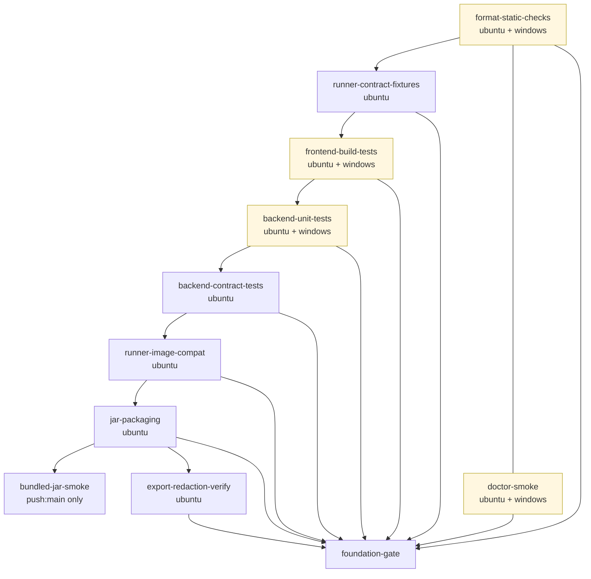

# CI Pipeline — Tiered Foundation Gates

Story 1.21 implements architecture rule AR28 (see `_bmad-output/planning-artifacts/architecture.md`):
a tiered CI pipeline that fails fast on cheap checks before paying for Docker-backed Testcontainers
and image builds. The pipeline lives at `.github/workflows/ci.yml`.

## Tier graph



`bundled-jar-smoke` is intentionally **not** a foundation-gate dependency — it runs only on
`push: refs/heads/main` so PR runs aren't blocked on a Docker-Compose-up-and-bootstrap test.

## Per-tier reference

| Tier | OS scope | Purpose | Typical runtime | What causes it to fail |
| --- | --- | --- | --- | --- |
| `format-static-checks` | ubuntu + windows | Spotless (Google Java Format), Checkstyle (`google_checks.xml`), SpotBugs (threshold `Medium` so MEDIUM findings appear in the XML/HTML report; only HIGH findings fail the build via the goal's default `failureThreshold`) | 30-60 s | Unformatted Java code, Checkstyle error-severity violation, HIGH-severity SpotBugs finding. Each plugin failure emits a `::error::` annotation: Spotless points at `./mvnw spotless:apply`; Checkstyle at the XML report under `deliveryline-backend/target/checkstyle-result.xml`; SpotBugs at the HTML report bundled in the uploaded `spotbugs-report-<os>` artifact. |
| `runner-contract-fixtures` | ubuntu | Runs `RunnerContractValidatorTest` against the JSON schema fixtures in `deliveryline-runner-contracts/src/main/resources/schemas/`. Single OS — contracts are runtime-agnostic JSON. | < 2 min | Schema v1 fixture validates against `context-bundle.v1.schema.json` or `runner-result.v1.schema.json` mismatch. |
| `frontend-build-tests` | ubuntu + windows | Story 2.1 — runs `mvn -pl deliveryline-frontend clean package`, which exercises the full `frontend-maven-plugin` chain: module-local Node v20.19.0 install → `npm ci` → `npm run build` (Vite) → `target/dist/`. Windows-matrix failure is build-blocking (never a warning). | 3-6 min (cold Node download); ~1 min warm | Vite build error (TypeScript strict-mode regression, missing dep), `npm ci` lockfile drift, Node download failure on Windows runner, frontend-maven-plugin execution error. |
| `backend-unit-tests` | ubuntu + windows | Surefire-only pure unit tests. Excludes `@Tag(architecture\|integration\|contract\|known-failure)`. Pins JVM defaults `-Duser.timezone=UTC -Dfile.encoding=UTF-8`. | 2-4 min | Any pure-unit test failure (excluding F17 known-failure which is tagged out). |
| `backend-contract-tests` | ubuntu | Failsafe — runs ArchUnit + Testcontainers + contract + integration tests on Linux (Testcontainers needs Docker). Picks up by `@Tag` or class-name suffix. AC7 — ArchUnit fails loudly with offending class + rule + remediation hint. Also runs the OpenAPI snapshot drift check (no-op until story 6.9). | 4-8 min | `ArchitectureBoundaryTest` rule violation, Testcontainers IT failure, contract-test failure, or (future) OpenAPI snapshot drift. |
| `runner-image-compat` | ubuntu | Builds both `runners/codex` + `runners/claude` Dockerfiles (`FROM scratch` placeholders today), then re-runs `RunnerContractValidatorTest` against the committed schema v1 fixtures. AC4 — catches drift between schemas and compiled validator. | < 2 min | Dockerfile parse error, validator drift. |
| `jar-packaging` | ubuntu | `mvn -pl deliveryline-backend -am -DskipTests package` produces the Spring Boot executable jar. Verifies the jar is structurally valid via `java -jar … --help` (Spring Shell `--help` exits 0 without booting Postgres). Uploads jar as artifact (7-day retention). | < 2 min | Maven package failure, jar startup failure. |
| `bundled-jar-smoke` | ubuntu (push:main only) | Boots Postgres via `docker compose up -d postgres`, downloads the packaged jar, invokes `deliveryline doctor --format json --only supported-environment,java-version,docker-availability` against the running jar. Tolerates `WARN`; fails on `FAIL`. | 3-5 min | Jar boot failure, doctor reports `FAIL`, Postgres not ready in 30 s. |
| `export-redaction-verify` | ubuntu | Re-runs `RedactionPolicyServiceContractTest`, `LoggingRedactionContractTest`, `RedactingMessageConverterUnitTest`. Story 5.1 will extend this tier to gate on actual exported-bundle redaction. | < 2 min | Any redaction-policy contract test regression. |
| `doctor-smoke` | ubuntu + windows | Story 1.17 — invokes `./scripts/doctor.sh` / `./scripts/doctor.ps1` against `mvnw spring-boot:run`. Verifies cross-platform doctor scripts work and `windows-latest` (Server 2022 → `matrixRow=win10-nearmiss`) still exits 0 because `DoctorService.aggregate()` only returns `FAIL` when a check FAILs. | 3-5 min | doctor reports FAIL, script invocation failure, Postgres unavailable on Linux runner. |
| `foundation-gate` | ubuntu (aggregator) | Placeholder for story 1.23. Depends on all 9 tiers + `doctor-smoke`. Runs with `if: always() && !cancelled()` and an explicit assertion step that fails when any `needs.*.result != 'success'` — so a `skipped` upstream tier (e.g. one OS in a `fail-fast: false` matrix failing) cleanly converts to an explicit `failure` on the aggregator. Without that, some branch-protection configurations treat a `skipped` required check as success and unblock merges. Body is currently a shell echo; story 1.23 replaces it with deterministic-fixture event-stream verification. Registered as a required status check on `main` branch protection — see `docs/ci-branch-protection.md`. | < 30 s | Any of the 10 upstream tiers failed (or was skipped/cancelled). |

## Why no blanket retries (AC5)

Architecture explicitly forbids broad retries on Docker-backed tests: "make flakiness visible
rather than masking it with broad retries"
(`_bmad-output/planning-artifacts/architecture.md` — Infrastructure Risk Controls:556).
The `backend-contract-tests`, `runner-image-compat`, and `bundled-jar-smoke` tiers do NOT wrap test
execution in retry actions or shell loops. If a Testcontainers cold-start flake is observed in the
field, the only acceptable mitigation is a narrow retry on the `docker pull` step with inline
justification — not on the test invocation itself.

## Concurrency policy (AC8 cost control)

The workflow declares:

```yaml
concurrency:
  group: ci-${{ github.workflow }}-${{ github.ref }}
  cancel-in-progress: ${{ github.event_name == 'pull_request' }}
```

This cancels in-progress runs for the same PR/ref. `main` push runs are NEVER cancelled because
they feed `bundled-jar-smoke` release-readiness — losing those signals to a cancel would mask
post-merge regressions.

### Per-job timeouts

Every job sets an explicit `timeout-minutes` (15-30 minutes depending on tier) so a hung
Testcontainers pull or docker build cannot consume the GitHub Actions default 360-minute budget
before the job is killed. Without this, a single stuck runner can burn ~6 hours of paid minutes.
Tier budgets:

- 5 min: `foundation-gate` (assertion-only)
- 10 min: `runner-contract-fixtures`
- 15 min: `format-static-checks`, `frontend-build-tests`, `jar-packaging`, `bundled-jar-smoke`,
  `export-redaction-verify`, `doctor-smoke`
- 20 min: `backend-unit-tests`, `runner-image-compat`
- 30 min: `backend-contract-tests` (Testcontainers + ArchUnit; largest budget)

### Least-privilege `GITHUB_TOKEN`

The workflow declares `permissions: contents: read` at top level so the implicit `GITHUB_TOKEN`
inherits read-only scope by default. Individual jobs that need to publish (future release-readiness
tiers, artifact-publishing jobs) must escalate explicitly with their own `permissions:` block —
defense-in-depth against a compromised PR job grabbing write access.

## Artifacts uploaded per tier (AC10)

Every test-executing tier uses `actions/upload-artifact@v4` with `if: always()` so reports are
available for triage even on failure. Naming convention: `<tier-name>-reports` (or `-reports-<os>`
for matrix tiers). Retention is 14 days; the `jar-packaging-artifact` is 7 days (the jar binary is
re-derivable, so longer retention is wasteful).

JaCoCo coverage XML/HTML is uploaded as `backend-coverage-jacoco`. There is **no coverage threshold
gate** in story 1.21 — that ships in story 2.32 per
`_bmad-output/planning-artifacts/epics.md`:1028. The artifact exists today so the
future gate has data to consume from day one.

## Workflow triggers

```yaml
on:
  pull_request:
  push:
    branches: [main]
```

No `workflow_dispatch` and no `schedule` triggers in story 1.21 — adding them changes the
foundation-gate semantics (a scheduled run on a stale commit could mask a regression introduced
post-schedule). Future stories can add them with explicit rationale.

## Related

- [`ci-branch-protection.md`](ci-branch-protection.md) — operational steps for marking
  `foundation-gate` as a required status check on `main`.
- [`supported-environments.md`](supported-environments.md) — OS / shell / container-runtime matrix
  consumed by the `doctor` `supported-environment` check.
- [`observability/log-schema.md`](observability/log-schema.md) — demo-profile JSON log shape; the
  `export-redaction-verify` tier gates on the redaction layout that produces this shape.
- Story 1.23 (backlog) — replaces the `foundation-gate` placeholder body with deterministic-fixture
  event-stream verification.
