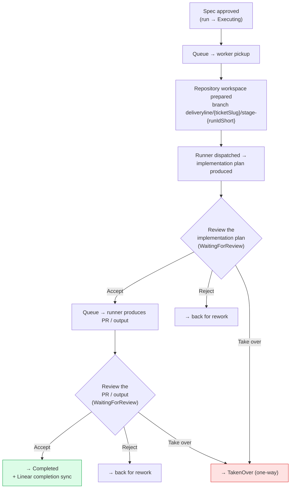
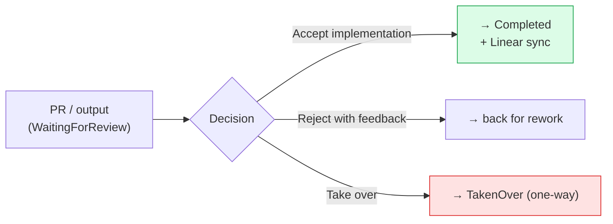

# Execution Walkthrough (Epic 3)

> **Developer walkthrough validator:** `_____________________________` (to be named before Epic 3 close)

This walkthrough is the **Developer's end-to-end guide to the execution stage** of the
DeliveryLine web app: what happens after a specification is approved, how an agent's
implementation plan and PR/output are produced and reviewed, how to accept / reject / take
over the work, and how the queue and worker pool run jobs in parallel — all in the browser,
on your first pilot run, unaided.

It pairs with [`quickstart.md`](quickstart.md) (which gets DeliveryLine running and a first
run submitted) and follows [`pm-loop-walkthrough.md`](pm-loop-walkthrough.md) (the
spec-review loop, upstream of this doc). For failed runs it pairs with
[`failure-recovery-walkthrough.md`](failure-recovery-walkthrough.md). This one is
**browser-based** — the only shell command shown (`deliveryline workers status`) is
OS-neutral, and everything works identically on Windows, macOS, and Linux (see
[`supported-environments.md`](supported-environments.md)).

**Target time:** ~15 minutes from approved spec to merge-ready PR review.

---

## The one thing to remember

> **Taking over is one-way in this release.** When you take over a run, DeliveryLine stops
> orchestrator dispatch, cancels the in-flight execution **and** any queued executions, and
> moves the run to the `TakenOver` terminal state. **There is no "undo" in Epic 3.** You then
> continue the work yourself in the linked GitHub PR. Read the
> [When and how to take over](#when-and-how-to-take-over) section before you click **Take
> over** — this is a deliberate hand-off, not a pause.

---

## Before you start (prerequisites)

You need two things in place:

1. **DeliveryLine running locally.** Follow [`quickstart.md`](quickstart.md) end-to-end first.
   When the app is up, open it in your browser — the root URL redirects to the review queue at
   `/workflows`.
2. **A governed run with an approved spec.** Somewhere upstream, a run produced a
   specification and a Product Manager approved it in the spec-review loop (the
   [`pm-loop-walkthrough.md`](pm-loop-walkthrough.md)). Spec approval transitions the run to
   `Executing` — that is the hand-off point where this walkthrough begins. You do not produce
   that state yourself.

You do **not** need a Linear login or any OS-specific setup for the review surfaces — they all
live in the browser. The single CLI command in this doc (`deliveryline workers status`) is an
optional inspection aid, not a required step.

---

## The execution stage at a glance

After a spec is approved, a run moves through two agent-driven phases, each ending in a human
review gate:



The linear sequence, step by step:

1. **What happens after spec approval** — queue → worker pickup → repository workspace
   prepared → runner dispatched → implementation plan generated.
2. **Reviewing the implementation plan** — the implementation-plan artifact panel.
3. **Accepting the plan** — the Decision Bar in `implementation_review` mode.
4. **What happens after plan approval** — queue → runner produces the PR/output.
5. **Reviewing the PR/output** — the diff display, branch + commit + PR references.
6. **Accepting / rejecting / taking over.**
7. **Completion + Linear sync.**

Each review gate parks the run in **`WaitingForReview`** and waits on you — exactly like the
spec gate parked it in `WaitingForSpecApproval` for the PM.

---

## Step 1 — What happens after spec approval

When the PM approves the spec, the run transitions to `Executing`. From there, DeliveryLine
does not dispatch the agent immediately and synchronously — it **enqueues** the work and a
**worker** picks it up when one is free (see
[How parallel execution works](#how-parallel-execution-works)). The sequence:

```text
spec approved
   │
   ▼
run enqueued ──▶ worker picks up the job
                     │
                     ▼
            repository workspace prepared
            (a fresh branch is created:
             deliveryline/{ticketSlug}/stage-{runIdShort})
                     │
                     ▼
            runner dispatched in a sandbox container
                     │
                     ▼
            implementation plan produced
                     │
                     ▼
            run parks in WaitingForReview  ◀── your turn
```

The branch the workspace is prepared on follows the shape
**`deliveryline/{ticketSlug}/stage-{runIdShort}`** — the ticket reference is slugified
(lowercased, non-alphanumerics collapsed to `-`) and the run id is shortened to its last 8
characters. For ticket `LIN-123` and run `run_…abc12345` the branch is
`deliveryline/lin-123/stage-abc12345`. You will see this branch again on the PR/output panel
(Step 4) and when you take over (it is the branch you continue working on).

When the run reaches `WaitingForReview`, open it from the queue at `/workflows` — same queue,
same tri-pane shell as the PM loop, but now the centre pane shows an **implementation plan**
instead of a specification.

---

## Step 2 — Reviewing the implementation plan

The implementation-plan artifact renders in the centre review pane. Its anatomy:

```text
┌─────────────────────────────────────────────────────────────┐
│  [ implementation-plan ]   v2  history                       │  ← type badge + revision
│                                                               │
│  Classification:  [ internal ]                                │  ← trusted metadata
│                                                               │
│  Steps                                                        │
│   ▸ Step 1   Add the CSV exporter interface                   │  ← numbered accordion
│   ▸ Step 2   Wire the exporter into the report service        │     (Enter/Space to expand;
│   ▸ Step 3   Add unit + integration tests                     │      arrow keys to navigate)
│        Complexity: [ medium ]                                 │
│        (expanded step detail renders here)                    │
│                                                               │
│  Context references                                           │
│   [ spec ] Approved specification        (in-app nav later)   │  ← internal + external refs
│   [ repository ] org/repo                                     │
│                                                               │
│  [ Compare ]  (disabled — available in next release)          │
└─────────────────────────────────────────────────────────────┘
```

- **Type badge + revision.** The panel labels the artifact `implementation-plan` and shows its
  version (`v2`) with a disabled `history` placeholder (revision history arrives later).
- **Steps.** The plan's ordered steps render as a keyboard-navigable accordion — each row reads
  **Step N** followed by the step summary; expanding a row reveals the detail and an optional
  **Complexity** chip. A step with no detail reads *"No further detail provided."* If the plan
  carries no steps at all, the section reads *"This implementation plan has no steps."*
- **Context references.** Internal references (e.g. the approved spec) render as
  keyboard-focusable placeholders (in-app deep-linking arrives in a later release); external
  references (repository / branch) render as links only when their URL is safe. An empty list
  reads *"No context references."*
- **Compare.** A reserved, disabled control — Compare Mode ships in Epic 4.

Read the plan the way you'd review a colleague's design: does it cover the ticket, is each step
sound, does it take the right approach? Those questions map directly to the rework tags you'll
use if you reject (see [Developer rejection taxonomy](#developer-rejection-taxonomy)).

### Accepting the plan — the Decision Bar (`implementation_review` mode)

At the bottom of the run sits the **Decision Bar**, here in its **`implementation_review`**
mode. It offers three actions:

```text
   Review implementation v2 by amelia (agent)
   ─────────────────────────────────────────────────────────────
   [ Accept implementation ]   [ Reject with feedback ]   [ Take over ]
   Accepting advances the run past technical review.
```

- **Accept implementation** (the single primary button) — *"Accepting advances the run past
  technical review."* For a plan, this sends the run on to produce the PR/output (Step 3).
- **Reject with feedback** (secondary) — *"Rejection sends the implementation back for
  rework."* Opens the rejection dialog (see
  [Developer rejection taxonomy](#developer-rejection-taxonomy)).
- **Take over** (secondary) — *"Taking over stops orchestration and hands the run to a
  developer."* Opens the takeover confirmation (see
  [When and how to take over](#when-and-how-to-take-over)). **Take over is always available**,
  even when accept/reject are not yet possible.

If the implementation isn't yet in a state you can accept or reject, the bar explains it
rather than showing a dead button: *"The implementation is not yet available for an accept or
reject decision."* — and **Take over** stays available above it.

> **A note on your role.** At this gate your recorded role is **`developer`**. As in the PM
> loop, **the pilot does not enforce role-based access** — the `developer` label is recorded
> on the audit trail for traceability ("who decided what"), not as an authorisation gate.
> Anyone with local access can perform any action.

---

## Step 3 — What happens after plan approval

Accepting the plan does **not** synchronously run the agent. As after spec approval, the next
phase is **enqueued** and a worker drains it:

```text
plan accepted
   │
   ▼
run re-enqueued ──▶ worker picks up the job
                       │
                       ▼
              runner dispatched (same workspace branch)
                       │
                       ▼
              PR / output produced
              (branch + commit + a GitHub PR)
                       │
                       ▼
              run parks in WaitingForReview  ◀── your turn again
```

The run returns to `WaitingForReview`, now carrying a **PR/output** artifact instead of a
plan. Open it from the queue exactly as before.

---

## Step 4 — Reviewing the PR / output

The PR/output artifact panel has two clearly separated regions: a **trusted reference panel**
(top) whose PR reference and state come from DeliveryLine's own integration record, and an
**untrusted diff region** (below) rendered from the agent's raw output.

```text
┌─────────────────────────────────────────────────────────────┐
│  [ pr-output ]   v1  history                                  │
│                                                               │
│  References          [ verified by DeliveryLine ]             │  ← trusted panel
│   BRANCH       deliveryline/lin-123/stage-abc12345            │
│   COMMIT       abc1234  [ copy ]                              │  ← short SHA + copy-full-SHA
│   PULL REQUEST org/repo#42   [ ⊙ Open ]                       │  ← PR ref + PrStateBadge
│   (last synced 2 minutes ago)                                 │
│                                                               │
│  ── Changed files ──  from the agent's output (untrusted) ──  │  ← untrusted diff region
│   [ Previous changed file ] [ Next changed file ]  3 files    │
│   ▸ src/export/CsvExporter.java        +120  −0               │  ← collapsed file accordion
│   ▸ src/report/ReportService.java       +14  −3               │
│   ▸ src/test/CsvExporterTest.java       +88  −0               │
│                                                               │
│  [ Compare ]  (disabled — available in next release)          │
└─────────────────────────────────────────────────────────────┘
```

**Trusted reference panel** — badged *"verified by DeliveryLine"*:

- **Branch** — the workspace branch (e.g. `deliveryline/lin-123/stage-abc12345`), linked to
  GitHub when the repository identity is known.
- **Commit** — the short commit SHA, with a **copy** button that copies the full SHA (it reads
  `copied` briefly after a successful copy), and a link to the commit.
- **Pull request** — the PR reference in `org/repo#42` form, alongside a **PR state badge**
  showing one of **Draft**, **Open**, **Merged**, or **Closed** (each badge pairs a colour with
  an icon + text label, so the state is readable without relying on colour). If no PR is linked
  yet, this reads *"No linked pull request."*
- **Last synced** — when DeliveryLine last reconciled the PR state. If GitHub can't be reached,
  the panel shows *"GitHub unreachable — showing cached state"* and keeps displaying the last
  known state rather than blanking out.

**Untrusted diff region** — visually and structurally separated, and labelled *"from the
agent's output (untrusted)"*:

- Files render as a **collapsed-by-default accordion**, each header showing the path and a
  `+additions −deletions` count. Expand a file to see its diff.
- **Previous changed file** / **Next changed file** move keyboard focus between file headers.
- A binary file reads *"Binary file — no textual diff shown."*
- When the agent produced no diff, the region reads *"No diff content was produced."* — a
  graceful empty state, not an error.
- Large diffs are paginated (*"Show more files (N of M)"*) and per-file content is capped, with
  a note when the cap applies — DeliveryLine never silently truncates.

---

## Step 5 — Accept, reject, or take over the PR/output

The same Decision Bar `implementation_review` mode renders under the PR/output, with the same
three actions:



- **Accept implementation** — accepting the PR/output advances the run to `Completed` and
  triggers the Linear completion sync (Step 7 below).
- **Reject with feedback** — sends the implementation back for rework with your reason + a
  rework tag (next section).
- **Take over** — hands the run to you (the section after next).

If the bar's view falls behind the run (a new revision lands while your screen is open), it
switches to an **Out of date** state — *"The run changed since this view loaded. Review the
latest version before deciding."* — with a **Refresh and review** button. The rule, as in the
PM loop: **never accept a version you didn't read.** Click **Refresh and review** and decide
against the new version.

---

## Developer rejection taxonomy

Clicking **Reject with feedback** opens a dialog that will not submit without both a free-text
reason **and** a rework tag:

```text
   ┌────────────────────────────────────────────────┐
   │  Reject with feedback                          │
   │                                                │
   │  Reason                                        │
   │  ┌──────────────────────────────────────────┐  │
   │  │ (explain what's wrong, in your words)    │  │
   │  └──────────────────────────────────────────┘  │
   │                                                │
   │  Kind of rework needed                         │
   │   ◯ Incorrect approach                         │
   │   ◯ Incomplete implementation                  │
   │   ◯ Quality issue                              │
   │   ◯ Breaks existing functionality              │
   │   ◯ Out of scope                               │
   │                                                │
   │   [ Confirm rejection ]   [ Cancel ]           │
   └────────────────────────────────────────────────┘
```

If you try to confirm without both fields, you'll see: *"Add a reason and select the kind of
rework needed before rejecting."*

The five **developer** rework tags are distinct from the three product/spec tags the PM uses.
Pick the one that best describes *why* the work needs rework — the choice feeds the Epic-5
rework-rate measurement (AR34b), so picking accurately keeps that metric honest:

| Tag | Use it when… | Example |
|---|---|---|
| **Incorrect approach** | The implementation solves the problem the wrong way technically. | The plan adds a brand-new table for data that already lives in the existing event log. |
| **Incomplete implementation** | The work is on the right track but unfinished. | The ticket asked for CSV *and* JSON export; only JSON was implemented. |
| **Quality issue** | The approach is right but the code quality is below bar. | No tests, copy-pasted logic, or unhandled error paths in otherwise-correct code. |
| **Breaks existing functionality** | The change regresses something that worked. | The new exporter changes a shared formatter and breaks the existing report output. |
| **Out of scope** | The work goes beyond (or sideways of) what the ticket asked for. | The ticket asked for an exporter; the PR also refactors an unrelated subsystem. |

---

## When and how to take over

**Take over** is the developer's escape hatch: it stops the agent and hands the run to you.
Clicking it opens a confirmation dialog with a **required reason** and the full consequence
text:

```text
   ┌──────────────────────────────────────────────────────────────┐
   │  Take over run                                                 │
   │                                                                │
   │  Stops orchestrator dispatch, cancels all in-flight + queued   │
   │  runner executions, records a developer takeover, and          │
   │  transitions the run to the TakenOver terminal state while     │
   │  preserving all prior context (artifacts, audit trail, and the │
   │  active GitHub PR link). This action is non-reversible in E3 — │
   │  Epic 4 will add takeover-revert; until then, a taken-over run │
   │  can only be closed by an operator action.                     │
   │                                                                │
   │  Reason (required)                                             │
   │  ┌──────────────────────────────────────────────────────────┐ │
   │  │ (why are you taking over?)                                │ │
   │  └──────────────────────────────────────────────────────────┘ │
   │                                                                │
   │   [ Confirm takeover ]   [ Cancel ]                            │
   └──────────────────────────────────────────────────────────────┘
```

What takeover does, precisely:

- **Stops orchestrator dispatch** — the agent will not be dispatched again for this run.
- **Cancels the in-flight execution and any queued executions** — those executions move to a
  `cancelled_for_takeover` status.
- **Records a developer takeover** on the append-only audit trail (who / when / why).
- **Transitions the run to `TakenOver`** — a terminal state. **This is non-reversible in the
  current release.** Epic 4 will add takeover-revert; until then a taken-over run can only be
  closed by an operator action.
- **Preserves all prior context** — artifacts, the audit trail, and the active GitHub PR link
  are kept.

After takeover, you **continue the work yourself in the linked GitHub PR**, on the run's branch
(`deliveryline/{ticketSlug}/stage-{runIdShort}`), using normal git tooling. The Decision Bar
replaces its actions with a read-only **Run is taken over** marker and — when a PR reference
was preserved — a **Continue work in PR {ref}** link that opens the PR in a new tab.

The run also surfaces a persistent **takeover attribution** block in the Run Context Strip once
it is in `TakenOver`:

```text
┌─────────────────────────────────────────────────────────────┐
│  [ Taken over ]   TAKEN OVER BY  alex (human)   ROLE developer │
│                   WHEN  3 minutes ago                          │
│  "Agent kept missing the auth edge case — finishing by hand."  │  ← your reason (escaped)
└─────────────────────────────────────────────────────────────┘
```

This block reads who took over (identity + actor type), the recorded role, when, and the
reason you gave — so the history answers "who took this over, and why?" later.

> Do not treat takeover as a pause. If you only want the agent to try again, **reject with
> feedback** instead — that sends it back for rework and keeps it agent-driven.

---

## How parallel execution works

DeliveryLine does not run every dispatched job immediately. Jobs are placed on a **FIFO queue**
and drained by a fixed-size **worker pool**, so several runs can progress at once without
overwhelming the host.

```text
   submit / accept ──▶  ┌──────── queue (FIFO) ────────┐
                        │  job  job  job  job  …        │
                        └──────────────┬───────────────┘
                                       │ dequeued in order
                        ┌──────────────▼───────────────┐
                        │  worker pool (size = 2)       │
                        │   ┌────────┐   ┌────────┐     │
                        │   │worker 1│   │worker 2│     │  each worker dispatches one
                        │   │ run A  │   │ run B  │     │  runner job at a time
                        │   └────────┘   └────────┘     │
                        └───────────────────────────────┘
```

The model in three facts:

- **Workers** are configured by `deliveryline.runner.worker-pool.size` (default `2`, clamped to
  1–32) and the master switch `deliveryline.runner.worker-pool.enabled` (default `true`). The
  size is the number of jobs that can run concurrently.
- **The queue is FIFO with back-pressure** at `deliveryline.runner.queue-max-depth` (default
  `100`). Enqueuing beyond the cap raises `RUNNER_QUEUE_FULL` (HTTP 503, retryable) and no job
  is queued — the cap protects the host rather than failing silently.
- **Monitoring** is available two ways (below).

### Inspect the queue + workers from the CLI

The one CLI command in this walkthrough prints the worker-pool state, queue depth,
oldest-queued age, stale counts, and per-worker current work:

```text
deliveryline workers status
```

Options: `--format text|json` (default `text`), `--watch` (refresh on an interval),
`--interval-ms <n>` (default `5000`), and `--batch-id <bat_…>` (scope to one batch). It is a
single OS-neutral invocation — no per-shell variants. For the full CLI surface see
[`cli/README.md`](cli/README.md).

```text
Worker pool: 2/2 active   Queue depth: 3   Oldest queued: 12s   Stale: 0
  worker-1   running   run_3f9c21a8   execution    8s
  worker-2   running   run_a1c8f550   investigation 3s
```

### Inspect via Grafana (observability profile)

When the optional observability stack is running —
`docker compose --profile observability up -d` — Prometheus + Grafana ship a **runner-queue
dashboard** plus **queue-depth alert rules** (e.g. `RunnerQueueDepthHigh` fires when depth
stays above 50 for 5 minutes; `RunnerPoolStarved` and `RunnerOldestQueuedStale` cover a stuck
pool). The observability profile is off by default — start it only when you want the
dashboards.

---

## What if the agent fails?

If a runner stage crashes, times out, or is detected as orphaned, the run transitions to
`Failed`. You'll see it two ways in the browser:

- The **Run Context Strip** shows a **Failed** chip plus a recovery baseline row (failed stage,
  failure category, last activity, and the recommended **next safe action**).
- The run timeline records the failure event.

When a failed run is safe to retry, the Decision Bar switches to its **`recovery_operator`**
mode and offers a single **Retry failed step** action — *"Retry re-executes the last failed
step with a fresh runner."* When retry is not a safe action, the bar reads **View only**
(*"No recovery action is available for this run right now."*). Note that this retry path is
requested under the **`workflow_owner`** role, not `developer` — retry is an operator action,
not part of the developer technical-review surface.

Deeper recovery — reconcile, resume, rerun, and the operator console — arrives in Epic 4. For
the CLI-side retry decision aid (the `next safe action` matrix and when *not* to retry), see
[`failure-recovery-walkthrough.md`](failure-recovery-walkthrough.md). This section sets
expectations; it is not a recovery manual.

---

## Step 7 — Completion + Linear sync

Accepting the PR/output advances the run to `Completed`. On completion, DeliveryLine writes a
**best-effort, after-the-fact, redaction-enforced completion comment** back to the source
Linear ticket — it never blocks the flow, and a sync hiccup never fails the run. The mechanics
(what's written, how redaction works, retry behaviour) are documented in
[`integrations/linear-completion-sync.md`](integrations/linear-completion-sync.md).

That closes the execution stage: an approved spec became a reviewed, merge-ready PR, and the
originating ticket was updated — in about 15 minutes of your attention across the two review
gates.

---

## Concepts you just used

This walkthrough stays within DeliveryLine's established vocabulary — see
[`glossary.md`](glossary.md) for the canonical definitions of **ticket**, **spec**, **run**,
**artifact**, **review**, **failure**, and **recovery action**, plus the new Epic-3 entries it
registers: **[worker pool](glossary.md#worker-pool)**, **[queue](glossary.md#queue)**,
**[takeover](glossary.md#takeover)**, **[PR linkage](glossary.md#pr-linkage)**, and
**[branch reference](glossary.md#branch-reference)** (with **implementation plan** and
**PR/output** as the two developer-review artifacts).

---

## What is NOT in this walkthrough

This doc covers the **execution stage** only — the developer-side review loop between an
approved spec and a merge-ready PR. The following live elsewhere:

- **Submitting a run** — covered by [`quickstart.md`](quickstart.md).
- **The spec-review (PM) loop** — see [`pm-loop-walkthrough.md`](pm-loop-walkthrough.md); it is
  upstream of this doc.
- **Failed runs and recovery depth** — see
  [`failure-recovery-walkthrough.md`](failure-recovery-walkthrough.md); the
  [What if the agent fails?](#what-if-the-agent-fails) section here only sets expectations.
- **Takeover-revert, reconcile / resume / rerun, and the operator console** — arrive with
  Epic 4. Takeover is one-way in Epic 3.
- **Compare Mode** (the disabled `Compare` control on the artifact panels) — arrives later.

If you reach a state this walkthrough doesn't describe, that's a signal the UI has moved ahead
of the doc — flag it to the Developer walkthrough validator named at the top.
