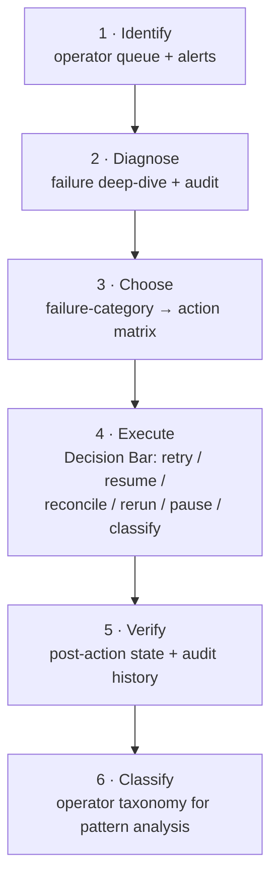

# Failed-Run Recovery Walkthrough (Epic 4 — operator console)

> **Operator walkthrough validator:** `_____________________________` (to be named before Epic 4 close)

This walkthrough is the **Operator's end-to-end guide to triaging a failed run in the
DeliveryLine console**: how to spot a run that needs attention, diagnose why it failed, choose
the right recovery action from the safety-ranked options, execute it (retry / resume /
reconcile / rerun-from-step / pause / classify), verify the outcome, and classify the failure
for cross-run pattern analysis — all in the browser, on your first pilot failure, unaided.

It is the Epic-4 companion to [`failure-recovery-walkthrough.md`](failure-recovery-walkthrough.md),
the Epic-1 CLI-only baseline (`retry` and the `next safe action` decision aid). That doc still
owns the single-command retry path and the `next safe action` matrix; **this** doc owns the
full operator console. Where the two overlap, they cross-link rather than duplicate. It also
pairs with [`quickstart.md`](quickstart.md) (which gets DeliveryLine running) and reuses the
takeover mechanics documented in [`execution-walkthrough.md`](execution-walkthrough.md). This
one is **browser-first with CLI equivalents** — every `deliveryline operator …` and
`deliveryline audit query` command shown is a single OS-neutral invocation that works
identically on Windows, macOS, and Linux (see
[`supported-environments.md`](supported-environments.md)).

**Target time:** ~10 minutes to triage your first failed run and apply the right recovery action.

---

## The one thing to remember

> **The console ranks every recovery action by safety — trust the ranking, and prefer the
> reversible option.** `retry` is always offered, but it is marked **Higher risk** for the
> categories where a blind re-run will just fail again (contract violations, malformed output,
> secret leaks). When the state is uncertain, **pause** to investigate — pausing is reversible
> (you resume later). **Taking over is one-way** and lives on a separate developer path, not on
> the recovery bar. Read the **Pause vs Takeover** section below before you take over.

---

## Background — why the deeper recovery surface exists

In Epic 1, the only recovery action was `retry`, and `RecoveryService` was pinned to that
minimum-viable baseline by an ArchUnit tripwire (`RECOVERY_SERVICE_IS_SCOPE_PROTECTED`) so a
future contributor could not stealth-add deeper methods. Epic 4 (stories 4.5–4.9) delivered the
sanctioned deeper surface — resume, reconcile, rerun-from-step, pause, and classify — and story
4.28 lifted the tripwire, replacing it with a governing architecture decision record. The full
rationale and the allow-listed recovery surface live in
[ADR 0033](adr/0033-recovery-service-scope-lift.md). That ADR is also the record confirming
that **takeover is deliberately *not* on `RecoveryService`** — it is a separate developer
action (see the **Pause vs Takeover** section below).

---

## Before you start (prerequisites)

You need three things in place:

1. **DeliveryLine running locally.** Follow [`quickstart.md`](quickstart.md) end-to-end first.
   When the app is up, open it in your browser.
2. **A run that has reached a `Failed`, stalled, orphaned, or conflict-paused state.** This
   walkthrough begins at the point where a run needs an operator — you do not produce that state
   yourself. (An agent execution that crashed or timed out, a runner-contract violation, or an
   integration conflict that auto-paused the run all land here.)
3. **A browser** — and, optionally, the CLI. Every step below shows the browser flow first and
   the equivalent `deliveryline operator …` command alongside it for CLI-preferring operators.

For the Epic-1 CLI-only path (the `deliveryline retry` decision aid and the `next safe action`
matrix), keep [`failure-recovery-walkthrough.md`](failure-recovery-walkthrough.md) open as the
companion — this doc does not re-derive that matrix.

---

## At a glance — the recovery loop



The six steps below follow that loop. Two axes run through it and are **kept separate on
purpose** (see [the two classification axes](#the-two-classification-axes)): the
machine-set **failure category** (what the runner did) drives Step 3's action choice; the
operator-applied **failure taxonomy** (your judgment of *why*) is recorded in Step 6.

---

## Step 1 — Identify the run that needs attention

Open the **Operator queue**. It lists exactly the runs that need an operator — its empty state
reads *"No runs need operator attention right now. Failed, stalled, orphaned, taken-over, and
overridden runs appear here."* Rows are virtualized; a failed run surfaces with its state and
failure category so you can scan quickly.

The filter sidebar (**Operator queue filters**) has four groups:

- **State** — Failed / stalled / orphaned / taken-over / overridden.
- **Failure category** — the runner-scoped categories from Step 3's matrix.
- **Runner kind** — ships **disabled**: *"Filtering by runner kind arrives in a future
  release."* Don't rely on it.
- **Time window** — Last 1 hour / 24 hours / 7 days / 30 days / All time.

A **Select multiple** toggle and a **Bulk operator actions arrive in a future release** button
are also present but **disabled** — bulk recovery is not wired yet. Ignore both for now.

```text
Operator queue                       [Select multiple] ( Bulk operator actions … )  <- both disabled

  Filters (sidebar):  State | Failure category | Runner kind (disabled) | Time window

  run_9f31c0a2   Failed   runner_timeout               <- highlighted: the run you are triaging
  run_7b22de10   Failed   runner_contract_violation
  run_4a90ff5c   Paused   external_state_advanced

  Empty state: "No runs need operator attention right now. Failed, stalled,
                orphaned, taken-over, and overridden runs appear here."
```

**CLI equivalent.** List the runs that need attention (default state filter is
`failed,stalled,orphaned`):

```text
deliveryline operator status --state failed,stalled,orphaned --since 24h --format text
```

**Getting notified proactively** instead of polling the queue — see
[Setting up alerts](#setting-up-alerts) at the end of this doc.

---

## Step 2 — Diagnose the failure

Open the run's **failure diagnostics** deep-dive (sheet title **Event diagnostics**). It answers
five questions:

| Field | What it tells you |
|---|---|
| **What happened** | the failure category (e.g. `runner_timeout`) |
| **Reason** | the recorded failure reason text (runner-authored, escaped) |
| **What changed** | `last successful stage → failed stage` |
| **Who acted** | the last actor identity (or `system`) |
| **What is next** | the top recommended recovery action / `next safe action` |

Below the five fields, a **Recommended recovery actions** block lists each candidate action
ranked by safety, with a colour-independent bracketed chip and its precondition:

```text
┌─ Event diagnostics ──────────────────────────────────────────┐
│ [Failed]                                                     │
│  What happened : Contract Violation                          │
│  Reason        : output failed runner-contract v1 validation │
│  What changed  : Investigating → Executing                   │
│  Who acted     : system                                      │
│  What is next  : pause                                        │
│  Correlation ID: ops-2026-07-18-3        [Copy]              │
│                                                              │
│  Recommended recovery actions                                │
│   [RISKY]  retry   — blind retry will likely re-fail         │
│                       Precondition: run is in Failed         │
│   [SAFE]   pause   — halt and investigate first              │
│                       Precondition: run is dispatchable      │
│   [SAFE]   classify_failure — record why it failed           │
│                       Precondition: always available         │
└──────────────────────────────────────────────────────────────┘
```

The chips read `[SAFE]` / `[CAUTION]` / `[RISKY]` on this surface. Only **`retry`** is wired for
one-click invocation from the deep-dive today; the other actions are surfaced-and-explained
here and executed from the Decision Bar in Step 4 below.

**CLI equivalent.** The `deliveryline operator diagnose` command prints the same five facts,
worded and ordered slightly differently — *"what happened / changed / who acted / what failed /
what is next"*. Its **"what failed"** is the console's **Reason** field; the two cover the same
five diagnostics, but the order differs (the CLI lists "what failed" fourth, where the console
puts **Reason** second).

```text
deliveryline operator diagnose run_7b22de10
```

For the full post-hoc trail (every event on the run, including prior recovery attempts), use the
audit query — the same command you'll use to verify the outcome in Step 5:

```text
deliveryline audit query --run run_7b22de10 --format text
```

---

## Step 3 — Choose a recovery action

DeliveryLine ranks recovery actions with a deterministic safety scale — **safe < caution <
risky** — computed from the run's current state, its failure category, and whether its external
Linear / GitHub state has drifted. `retry` is **always** offered; `classify_failure` is
**always safe**. The table below maps each of the twelve live **failure categories** to the
action you'll usually reach for, consistent with that ranking.

| Failure category | What it means | Usual action | When to choose an alternative |
|---|---|---|---|
| `runner_timeout` | the stage exceeded its timeout before posting output | **retry** (safe) | if it recurs, `pause` and check the stage-timeout config |
| `runner_crash` | the runner process exited without posting a result | **retry** (safe) | repeated crashes → `pause`, then classify as agent-execution failure |
| `runner_non_zero_exit` | the runner exited non-zero without violating the contract | **retry** (safe) | two in a row → `pause` and investigate the adapter |
| `runner_late_result` | a result arrived after the stale threshold and was rejected | **retry** (safe) *if* `next safe action: retry` | if `await_manual_reconciliation`, do **not** retry — `reconcile` |
| `runner_contract_violation` | output failed runner-contract v1 validation | **pause** to investigate (retry is **Higher risk**) | a blind retry will likely re-fail; fix the adapter/prompt first |
| `runner_malformed_output` | output failed JSON/schema parsing (non-contract cause) | **pause** to investigate (retry is **Higher risk**) | retry once only if you suspect a transient stream error |
| `runner_duplicate_result` | the runner posted two results for one execution | **pause** — at-least-once delivery bug | `reconcile` if the double write left artifact drift |
| `runner_secret_leak` | a secret was detected in runner output | **pause** and remediate (retry is **Higher risk**) | never blind-retry; rotate the secret, then classify |
| `runner_build_failed` | the backend build gate failed after the auto-fix loop exhausted | **retry** (caution) after a fix, or `classify_failure` | if the failure is environmental, treat as tooling/infra |
| `testcontainers_infra_failed` | the per-run test-container sidecar couldn't be provisioned | **retry** (caution) once infra is restored | persistent → `pause` and check the host/Docker |
| `recovery_dispatch_failed` | a prior rerun's re-enqueue failed after its prep committed | **retry** / **resume** (safe) | the run was compensated back to Failed — a fresh dispatch is safe |
| `orphan` | the execution was detected as orphaned (no activity, no result) | **retry** (caution) | if the orphan left artifact drift, `reconcile` (caution) |

**One rule the ranking enforces:** when the run's external state has **drifted** (its Linear
ticket or GitHub PR moved underneath it), every *other* safe mutating action is downgraded to
**caution** — only **reconcile** and **classify** stay safe. That is the console telling you to
resolve the divergence before you re-drive anything.

### Worked examples

- **`runner_timeout`** → **retry** (safe). The timeout fires before the runner can post output,
  so no partial write is in flight; a clean re-dispatch is the right call.
- **`runner_contract_violation`** → **pause** to investigate. A blind retry re-runs the same
  misbehaving adapter/prompt and will likely violate the contract again — pause, read the
  runner log, fix the root cause.
- **An `external_state_advanced` integration conflict** → **reconcile** with **Accept external
  state**. The external system moved ahead; adopt it as authoritative (see
  [Step 4's auto-pause section](#when-the-orchestrator-auto-pauses-on-a-conflict)).
- **A repeatedly-failing run you judge to be an agent-execution failure** → **pause**, or hand
  off via **takeover** if the pattern persists and a human will carry the work forward. Note:
  *"agent execution failure"* here is your **taxonomy** judgment (Step 6), a different axis from
  the runner's failure category — both can be recorded on the same run.

### The two classification axes

DeliveryLine keeps **two independent classification axes** on a failed run:

- **Failure category** (the table above) is **runner-scoped and machine-set** — it records
  *what the runner execution did*. Twelve wire values, set automatically on the failing
  transition. It drives the recommended action.
- **Failure taxonomy** (Step 6) is **operator-applied and post-hoc** — it records *your
  judgment of why the run failed*, for cross-run pattern analysis. Six wire values, set by you.

Both can be set on one run — a `runner_crash` (category) that you classify as an
`agent_execution_failure` (taxonomy), for example. Don't map one onto the other; they answer
different questions.

---

## Step 4 — Execute the recovery action

When you open a failed run, the **Decision Bar** renders in `recovery_operator` mode (requested
as the `workflow_owner` role). It exposes exactly **six** actions. The ranker flags each on a
non-colour safety scale: **Caution** or **Higher risk** appears as an affix on the action, while
a **safe** action carries *no* affix (safe is the unmarked default):

| Action | Button label | What it does |
|---|---|---|
| `retry` | **Retry failed step** | re-execute the last failed step with a fresh runner |
| `resume_workflow` | **Resume run** | return a paused run to its prior executing state |
| `reconcile_conflict` | **Reconcile conflict** | resolve an internal-vs-external divergence |
| `rerun_from_step` | **Rerun from step** | re-execute from a chosen safe step (supersedes later artifacts) |
| `pause_workflow` | **Pause run** | halt dispatch and cancel in-flight + queued work (reversible) |
| `classify_failure` | **Classify failure** | record the operator taxonomy (see Step 6) |

Each mutating action confirms with its exact consequence copy before it fires:

- **Retry failed step** — *"Retry will re-execute the last failed step with a fresh runner. The
  previous failure will be preserved in the timeline."*
- **Resume run** — *"Resume will return the run to its prior executing state and re-enqueue
  runner work."*
- **Pause run** — *"Pause will halt orchestrator dispatch and cancel in-flight + queued runner
  work for this run. The run can be resumed later."*
- **Rerun from step** — *"Rerun will re-execute the run from the selected safe step. Artifacts
  produced at or after that step are superseded and the corresponding approval is invalidated."*
  (You pick the target step — **Investigating** or **Executing** — and a required reason.)

```text
┌─ Recovery actions ───────────────────────────────────────────┐
│  [ Retry failed step ]        Higher risk                    │
│  [ Resume run ]               (no affix — safe)              │
│  [ Reconcile conflict ]       (no affix — safe)              │
│  [ Rerun from step ]          Higher risk                    │
│  [ Pause run ]                (no affix — safe)              │
│  [ Classify failure ]         (no affix — safe)              │
│                                                              │
│  (only caution / higher-risk actions show an affix;          │
│   affixes are per-run — the ranker re-scores on every load)  │
└──────────────────────────────────────────────────────────────┘
```

**CLI equivalents** (each is a single OS-neutral invocation):

```text
deliveryline retry run_9f31c0a2 --actor-identity alex
deliveryline operator resume run_4a90ff5c
deliveryline operator reconcile run_4a90ff5c --conflict <conflictId> --decision accept_external_state --reason "..."
deliveryline operator rerun-from-step run_9f31c0a2 --target executing
deliveryline operator pause run_7b22de10 --reason "investigating contract violation"
deliveryline operator classify-failure run_7b22de10 --taxonomy agent_execution_failure
```

> Note: `retry` is the top-level `deliveryline retry` command (not `deliveryline operator
> retry`); the other five live under `deliveryline operator …`.

### When the orchestrator auto-pauses on a conflict

Sometimes DeliveryLine pauses a run **for you**. When it detects that the external system moved
underneath a run — an `external_state_advanced` or `external_state_reverted` conflict — it
**auto-pauses**. This is intentional: when the internal and external state disagree, the safe
posture is to stop and let an operator decide, not to keep dispatching against an uncertain
world. A manual **Resume** that tries to skip the reconciliation is blocked by a dispatch gate —
you can't bypass it.

To resolve, open the **Reconciliation dialog**. It shows both snapshots side by side —
**Internal state** and **External state** — with the differences highlighted, and a
**Reconciliation decision** radio group. The four decisions (the safe-first one is marked
**Recommended**; a **Reason** is required):

| Decision | Label | Consequence |
|---|---|---|
| `accept_external_state` | **Accept external state** | adopt the external system as authoritative; internal-only progress since the divergence is discarded |
| `accept_internal_state` | **Accept internal state** | re-assert the internal state and may re-drive the external system (can re-open an externally-merged PR) |
| `mark_completed_externally` | **Mark completed externally** | record the work was completed outside the workflow; close the run |
| `mark_failed_externally` | **Mark failed externally** | record the work failed/was abandoned outside the workflow; close the run |

On this dialog the safety chips are two-tier — **SAFE** / **RISKY** (not the Decision Bar's
three tiers).

```text
┌─ External state advanced · GitHub ───────────────────────────┐
│  ┌ Internal state ────────┐   ┌ External state ────────────┐ │
│  │ status : Executing     │   │ status : Merged            │ │
│  │ pr     : open          │   │ pr     : merged  ◀ differs  │ │
│  └────────────────────────┘   └────────────────────────────┘ │
│  Reconciliation decision                                     │
│   ◉ Accept external state          SAFE   (Recommended)      │
│   ○ Accept internal state          RISKY                     │
│   ○ Mark completed externally      SAFE                      │
│   ○ Mark failed externally         RISKY                     │
│  Reason: [ external PR was merged by the on-call dev ______ ]│
│                                    [ Confirm reconcile ]     │
└──────────────────────────────────────────────────────────────┘
```

### Classify the failure

The **Classify failure** action opens the classification dialog (title **Classify failure**).
Its fieldset legend is **Failure category**, and it renders one radio card per taxonomy value
with a **humanized** label, a description, and concrete examples — you never see raw snake_case
here. Pick one, add an optional **Reason**, and submit with **Apply classification**.
A retired value shows a `(deprecated, use X instead)` affix. Re-classifying keeps the prior
classification in audit history.

```text
┌─ Classify failure ───────────────────────────────────────────┐
│  run_7b22de10 · Failure category: runner_contract_violation  │
│  Failure category                                            │
│   ○ Specification Gap      The failure traces to missing …   │
│   ○ Context Gap            The agent lacked repository …     │
│   ◉ Agent Execution Failure  The agent/runner failed to …    │
│       • The runner produced malformed output …               │
│   ○ Review Rejection       …                                 │
│   ○ Integration or Merge Failure  …                          │
│   ○ Tooling or Infrastructure Failure  …                     │
│  Reason (optional): [ _________________________________ ]    │
│                                   [ Apply classification ]   │
└──────────────────────────────────────────────────────────────┘
```

The six values and their prose are covered in Step 6 below.

---

## Pause vs Takeover — when to choose which

Both stop a run, but they are **fundamentally different** and live on different paths:

|  | **Pause** | **Takeover** |
|---|---|---|
| Surface | the recovery Decision Bar (**Pause run**) | the developer / takeover path (a separate service) |
| Reversible? | **Yes** — resume later with **Resume run** | **No** — non-reversible in the current release |
| Use it when | you need to investigate and will resume | a human will carry the work forward outside the orchestrator |
| End state | run is paused, resumable | run stays `TakenOver` until an operator action closes it |

**Pause** is your default for "stop and think." It halts orchestrator dispatch and cancels
in-flight + queued runner work, and you resume when you're ready — nothing is lost.

**Takeover** is a deliberate, one-way hand-off. It is **not one of the six recovery actions** —
it is a separate developer action (`POST /api/v1/workflows/{id}/takeover`), and it stays
scope-protected per [ADR 0033](adr/0033-recovery-service-scope-lift.md). After takeover the
developer continues in the linked GitHub PR using normal git tooling, and the run remains
`TakenOver`. The full takeover mechanics — what gets cancelled, how context is preserved — are
documented in [`execution-walkthrough.md`](execution-walkthrough.md); this section only tells
you *when* to reach for it: **prefer pause for investigation; take over only when a human owns
the work long-term.** Do not treat takeover as an undo.

---

## Step 5 — Verify the outcome

After you act, confirm the run moved where you expected and that the audit trail recorded your
intervention. Every recovery action appends an event with an intervention marker, so a run's
history is a complete, append-only record of what the runner did *and* what operators did.

Query it by run:

```text
deliveryline audit query --run run_9f31c0a2 --format text
```

```text
┌─ Audit history — run_9f31c0a2 ───────────────────────────────┐
│ 2026-07-18T09:59:30Z workflow.stateChanged system  Executing→Failed  reason="runner timeout"
│ 2026-07-18T10:04:00Z recovery.retried     alex    Failed→Executing   reason="retry" [intervention]
│ 2026-07-18T10:11:20Z workflow.stateChanged system  Executing→Completed
│ 2026-07-18T10:11:21Z recovery.failureClassified alex  (taxonomy=agent_execution_failure) [intervention]
└──────────────────────────────────────────────────────────────┘
```

The same history is available in the console (the run timeline / audit view) and over REST at
`GET /api/v1/audit/by-run/{id}`. If the run did **not** move as expected — e.g. a **Resume** was
blocked — re-read the diagnostics: an unresolved conflict will hold the run until you reconcile.

---

## Step 6 — Classify for pattern analysis

Once the run is stable, **classify** it. The failure taxonomy is the operator-judgment axis
(distinct from the runner's failure category, per [the two classification axes](#the-two-classification-axes));
it feeds cross-run pattern analysis so the team can see *why* runs fail over time, not just what
the runner did. The six canonical values (wire value → humanized label, with when to use each):

| Wire value | Label | Use it when … |
|---|---|---|
| `specification_gap` | **Specification Gap** | the failure traces to missing, ambiguous, or incorrect requirements in the spec — not to execution (e.g. acceptance criteria omitted a required edge case) |
| `context_gap` | **Context Gap** | the agent lacked repository or domain context (e.g. it reimplemented a helper that already existed because it wasn't in the context bundle) |
| `agent_execution_failure` | **Agent Execution Failure** | the agent/runner failed to produce a valid result despite adequate spec and context (e.g. malformed output that failed contract validation; a loop that never converged) |
| `review_rejection` | **Review Rejection** | a human or automated review rejected the work product (e.g. rejected twice for scope creep; an unaddressed security finding) |
| `integration_or_merge_failure` | **Integration or Merge Failure** | the failure occurred at the integration boundary — push, merge, or external ticket sync (e.g. rejected by a required status check; a merge conflict blocked delivery) |
| `tooling_or_infrastructure_failure` | **Tooling or Infrastructure Failure** | tooling, CI, or infrastructure failed rather than the work itself (e.g. the runner image lacked a required JDK; CI timed out during an outage) |

You see the humanized label + description + examples in the console dialog; the snake_case wire
value is the stored / analytics form. Because both axes coexist, a single run can be, say, a
`runner_build_failed` (category) that you judge a `tooling_or_infrastructure_failure`
(taxonomy).

---

## Setting up alerts

So pilots don't have to watch the operator queue
by hand, DeliveryLine ships Prometheus alert rules you can route to Slack / email / PagerDuty.
Bring up the observability stack with the compose profile:

```text
docker compose --profile observability up -d
```

That starts Prometheus + Grafana + Alertmanager. Three alert rules matter for recovery
operators (enablement + routing are documented in the observability stack's alerting README at
`infra/observability/prometheus/README-alerting.md`):

| Alert | Fires when | For |
|---|---|---|
| **`RunnerQueueDepthHigh`** | `deliveryline_runner_queue_depth > 50` | 5m |
| **`RunnerOldestQueuedStale`** | `deliveryline_runner_queue_oldest_age_seconds > 1200` (2× the 600s stage timeout) | 1m |
| **`IntegrationConflictUnresolvedHigh`** | `sum(deliveryline_integration_conflict_unresolved_count) > 5` | 10m |

The first two warn that the worker pool is falling behind (runs will start stalling); the third
warns that internal state is diverging from external Linear / GitHub state without an operator
reconciling — exactly the auto-pause situation from
[Step 4](#when-the-orchestrator-auto-pauses-on-a-conflict). Wire these into Alertmanager routing
so a pilot is paged before the queue backs up rather than discovering it in the console.

---

## Concepts you just used

This walkthrough stays within DeliveryLine's established vocabulary — see
[`glossary.md`](glossary.md) for the canonical definitions of **ticket**, **spec**, **run**,
**artifact**, **review**, **failure**, and **recovery action**, plus the new Epic-4 entries it
registers: **[resume](glossary.md#resume)**, **[reconcile](glossary.md#reconcile)**,
**[rerun-from-step](glossary.md#rerun-from-step)**, **[pause](glossary.md#pause)**,
**[classify](glossary.md#classify)** (the failure taxonomy), **[conflict](glossary.md#conflict)**,
and **[drift](glossary.md#drift)**. **[Takeover](glossary.md#takeover)** was registered in
Epic 3 and is extended there with a pointer to the
**Pause vs Takeover** section above.

---

## What is NOT in this walkthrough

This doc covers the **operator recovery console** — triaging and recovering a failed run. The
following live elsewhere:

- **The Epic-1 CLI-only retry baseline** and the `next safe action` matrix — see
  [`failure-recovery-walkthrough.md`](failure-recovery-walkthrough.md); this doc cross-links it
  rather than repeating it.
- **Takeover mechanics** (what gets cancelled, how context is preserved) — see
  [`execution-walkthrough.md`](execution-walkthrough.md). This doc only tells you *when* to take
  over versus pause.
- **Submitting a run** — [`quickstart.md`](quickstart.md).
- **Bulk recovery and the runner-kind queue filter** — shipped **disabled** ("arrives in a
  future release"); don't rely on them.

If you reach a state this walkthrough doesn't describe, that's a signal the console has moved
ahead of the doc — flag it to the Operator walkthrough validator (named at the top once assigned,
before Epic 4 close).
