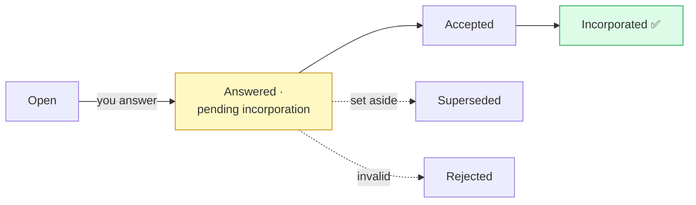
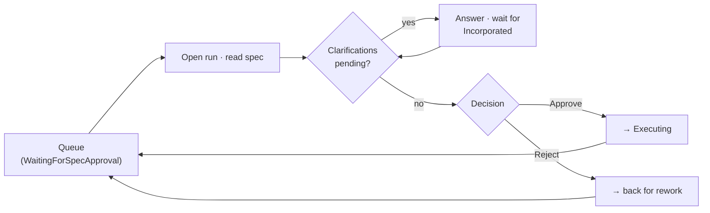

# PM-Loop Walkthrough (Epic 2)

> **PM-loop validator:** `_____________________________` (to be named before Epic 2 close)

This walkthrough is the **Product Manager's end-to-end guide to the spec-review loop** in the
DeliveryLine web app: open a run from the queue, read its specification, answer any clarification
questions, watch your answers get *incorporated*, and approve or reject with structured feedback —
all in the browser, on your first pilot run, unaided.

It pairs with [`quickstart.md`](quickstart.md) (which gets DeliveryLine running and a first run
submitted) the way the [`failure-recovery-walkthrough.md`](failure-recovery-walkthrough.md) pairs
with it for failed runs. This one is **browser-only** — there are no shell commands here, and it
works identically on Windows, macOS, and Linux (see
[`supported-environments.md`](supported-environments.md)).

**Target time:** ~10 minutes from opening the queue to completing your first review decision.

---

## The one thing to remember

> **Answered is not incorporated.** When you answer a clarification, the spec is *not yet*
> rebuilt with your input. The item will read **"Answered · pending incorporation"**. **Wait
> until it reads "Incorporated" before you approve.** This is the single most common first-run
> mistake — the rest of this doc exists to make it impossible for you to make it by accident.

---

## Before you start (prerequisites)

You need two things in place:

1. **DeliveryLine running locally.** Follow [`quickstart.md`](quickstart.md) end-to-end first.
   When the app is up, open it in your browser — the root URL redirects to the review queue at
   `/workflows`.
2. **A governed run waiting for your review.** Somewhere upstream, a run has produced a
   specification and is now parked in the **`WaitingForSpecApproval`** state, waiting on a human.
   You do not create this state yourself — the spec stage produces it. If no run is waiting, your
   queue will be empty (Step 1 below shows what that looks like).

You do **not** need the CLI, a Linear login, or any OS-specific setup for the review loop itself —
everything below happens in the browser.

---

## How the screen is laid out (the tri-pane shell)

Every run you open is shown in a **three-region layout**. The specification (the artifact you are
reviewing) is the centre of attention — everything else orients you around it:

```text
┌──────────────┬─────────────────────────────────────────────┐
│  QUEUE       │  RUN CONTEXT STRIP  (who / what / when)      │
│  (left rail) ├─────────────────────────────────────────────┤
│              │                                             │
│  • run A   ◀─┤   SPECIFICATION  (the artifact you read)    │
│  • run B     │                                             │
│  • run C     │   CLARIFICATIONS  (questions + lifecycle)   │
│              │                                             │
│              │   DECISION BAR   (Approve / Reject)         │
└──────────────┴─────────────────────────────────────────────┘
```

- **Left rail — the queue.** Every run needing attention; click one to open it.
- **Centre top — the run context strip.** A one-line orientation banner (covered in Step 2).
- **Centre — the specification, the clarifications, and the decision bar.** This is where you do
  the actual review.

---

## Step 1 — Open the review queue

The queue lives at `/workflows` (the app's home page redirects here). A run that needs your review
shows a **`WaitingForSpecApproval`** state badge, styled as a *warning* (amber) signifier so it
stands out from informational and completed runs:

```text
  Run review queue                                        [ Submit a run ]
  ───────────────────────────────────────────────────────────────────────
   ●  run_3f9c21a8   LIN-101   [ WaitingForSpecApproval ]   2 hours ago
      run_77b0e4d1   LIN-102   [ Completed ]                yesterday
      run_a1c8f550   LIN-103   [ Executing ]                5 minutes ago
```

Click the run in `WaitingForSpecApproval`. That opens it at `/workflows/<runId>` (e.g.
`/workflows/run_3f9c21a8`).

**If the queue is empty**, you'll see:

> No specifications awaiting review. New runs from Linear appear here once submitted — or submit a
> run from a Linear ticket.

…with a **"Submit a run"** button. An empty queue means nothing is waiting on you right now — not
that something is broken.

---

## Step 2 — Open the run and get your bearings

With a run open, read the **run context strip** across the top before diving into the spec. It is a
single lightweight row of labelled fields:

| Field | What it tells you |
|---|---|
| **Run** | The run's id (`run_…`). |
| *(state badge)* | The current workflow state, e.g. `WaitingForSpecApproval`. |
| **Stale** *(chip, only if shown)* | The run hasn't had recent activity — a heads-up, not an error. |
| **Escalated** *(chip, only if shown)* | The run was flagged for attention. |
| **Actor** | Who last acted, as `Identity (type)` — e.g. `amelia (agent)`. |
| **Revision** | The artifact you're looking at and its version — e.g. `specification v2`. |
| **Last transition** | When the run last changed state (hover for the exact UTC time). |
| **Trigger** | The originating ticket — e.g. `linear:LIN-101`. |
| **Branch** | The git branch/commit. In Epic 2 this always reads **"Not reported"** — that is expected, not a bug. |

Any field with no value shows **"Not reported"** rather than a blank.

Now read the **specification** in the centre pane. This is the plan the run produced for how the
ticket will be executed — read it the way you'd review a colleague's proposal: does it cover the
ticket, is it clear, does it take the right approach? Those three questions map directly to the
rework tags you'll use if you reject (see Step 4).

---

## Step 3 — Answer clarifications, and watch the incorporation lifecycle

A run may ask you **clarification questions** before its spec can be finalised. These appear in the
**Clarification Region** below the spec. Each question carries a status, and — this is the
important part — **answering a question does not immediately change the spec.**

### What you'll see when you answer a clarification

Each clarification shows a status label and a small **3-stage lifecycle indicator**:

```text
   submitted  ───▶  accepted  ───▶  incorporated
      ●                ○                ○
```

The dot fills as your answer moves through the pipeline. Here is exactly what each status means to
you:

| Status label (what you see) | What it means | Safe to approve? |
|---|---|---|
| **Open** | The question is waiting for your answer. | No — answer it first. |
| **In progress** | You've started an answer but haven't submitted it yet. | No — submit it first. |
| **Answered · pending incorporation** | You answered. The spec has **not** been rebuilt yet. | **No — wait.** |
| **Accepted** | Your answer was accepted and is being applied to the spec. | Not yet. |
| **Incorporated** | The spec has been rebuilt to reflect your answer. | **Yes.** |
| **Superseded** | A newer answer/version set this one aside — check for a follow-up. | See the note shown. |
| **Rejected** | Your answer was judged invalid — read the reason and re-answer. | No. |
| **Invalid answer** | Your answer couldn't be accepted as written — revise and resubmit. | No. |

Mapped onto the indicator: an **Answered** item still sits on the **first** dot (`submitted`); only
an **Incorporated** item reaches the **third** dot.



### The make-or-break rule

> **If you answer a clarification and it still reads "Answered · pending incorporation" (the
> lifecycle indicator has not reached "Incorporated"), the specification is not yet rebuilt with
> your input. Do not approve. Wait for "Incorporated".**

Approving while answers are still pending means you'd be approving the *old* spec — the one that
didn't yet include your clarification. The decision bar actively helps you here: while
clarifications are still pending, the **Approve** action is **blocked** (see Step 4).

---

## Step 4 — Approve or reject with feedback

At the bottom of the run sits the **Decision Bar**. It has two states you need to recognise.

### Blocked — when you can't approve yet

While clarifications are still pending incorporation, the bar shows a **"No decision available"**
chip and an explanation:

```text
   ⛔  No decision available
   2 clarifications pending incorporation — approval blocked
```

(The number agrees with how many of your answers haven't reached **Incorporated** yet.) This is the
system enforcing the make-or-break rule for you.

### Ready — when you can decide

Once everything is incorporated, the bar offers your two actions:

```text
   [ Approve specification ]   [ Reject with feedback ]
   Approval will transition the run to Executing.
```

- **Approve specification** (the primary button) — *"Approval will transition the run to
  Executing."* The run leaves your hands and proceeds to the execution stage.
- **Reject with feedback** (the secondary button) — *"Rejection sends the specification back for
  rework."* This opens the rejection dialog below.

### The rejection dialog

Clicking **Reject with feedback** opens a small dialog. It will not let you submit an empty
rejection — both a reason and a rework tag are required:

```text
   ┌────────────────────────────────────────────────┐
   │  Reject with feedback                          │
   │                                                │
   │  Reason                                        │
   │  ┌──────────────────────────────────────────┐  │
   │  │ (explain what's wrong, in your words)    │  │
   │  └──────────────────────────────────────────┘  │
   │                                                │
   │  Kind of rework needed                         │
   │   ◯ Missing scope                              │
   │   ◯ Unclear specification                      │
   │   ◯ Misunderstood implementation               │
   │                                                │
   │   [ Confirm rejection ]   [ Cancel ]           │
   └────────────────────────────────────────────────┘
```

If you try to confirm without both fields, you'll see: *"Add a reason and select the kind of rework
needed before rejecting."*

### Choosing the right rework tag

The three tags are not interchangeable — picking the right one keeps the pilot's rework-rate
measurement honest (the Epic 5 reporting reads these tags). Use this rule of thumb:

| Tag | Use it when… | Example |
|---|---|---|
| **Missing scope** | The spec leaves out something the ticket asked for. | The ticket asked for CSV *and* JSON export; the spec only covers JSON. |
| **Unclear specification** | The spec is ambiguous or too vague to act on. | The spec says "handle errors gracefully" without saying what the user actually sees. |
| **Misunderstood implementation** | The spec took the wrong technical approach or misread the system. | The spec plans a brand-new table for data that already lives in the existing event log. |

After you approve or reject, you're done with this run — head back to the queue (`/workflows`) and
pick the next one.



---

## What if the spec changed while I was reviewing?

DeliveryLine binds your decision to the exact spec version you were looking at. If the
specification is updated underneath you (a new revision lands while your screen is open) and you try
to act, the decision bar switches to an **"Out of date"** state instead of submitting:

> The specification changed since this view loaded. It is now at version *N*. Review the new
> version before approving.

…with a **"Refresh and review"** button. The rule is simple: **never approve a spec you didn't
read.** Click **Refresh and review**, read the new version, and make your decision against *that*.
This is deliberate — it prevents you from approving a revision you never actually saw.

---

## A note on your role label

Throughout the app your recorded role appears as **`product_reviewer`**, with the clarifier
**"recorded for audit only — not an enforced permission"**.

This is important to understand: **the pilot does not enforce role-based access.** Anyone with local
access to DeliveryLine can perform any action — the `product_reviewer` label is recorded on the
audit trail for *traceability*, so the history shows who decided what. It is **not** an
authorisation gate. Don't rely on it to stop someone else from acting; do rely on it to answer
"who approved this?" later.

---

## Concepts you just used

This walkthrough stays within DeliveryLine's established vocabulary — see
[`glossary.md`](glossary.md) for the canonical definitions of **ticket**, **spec**, **run**,
**artifact**, and **review**, plus the new **[clarification](glossary.md#clarification)** entry that
defines the incorporation lifecycle (open → answered → accepted → incorporated, with superseded /
rejected_invalid as off-path outcomes) you saw in Step 3.

---

## What is NOT in this walkthrough

This doc covers the **spec-review** loop only — the human gate between a generated specification and
execution. The following live elsewhere:

- **Submitting a run** — covered by [`quickstart.md`](quickstart.md); the "Submit a run" button on
  the queue is the in-app shortcut.
- **Failed runs and recovery** — see
  [`failure-recovery-walkthrough.md`](failure-recovery-walkthrough.md).
- **Reviewing implementation output and PR artifacts** — arrives with Epic 3's developer-review
  surfaces.
- **The operator console and the deeper recovery action set** (reconcile / takeover / resume /
  rerun) — arrives with Epic 4.

If you reach a state this walkthrough doesn't describe, that's a signal the UI has moved ahead of
the doc — flag it to the PM-loop validator named at the top.
